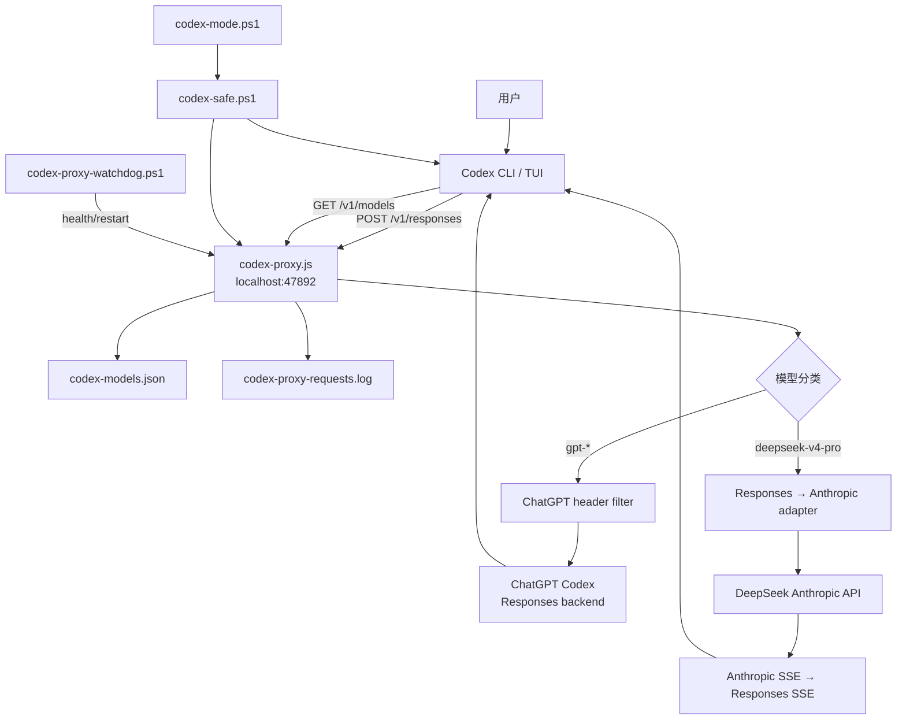
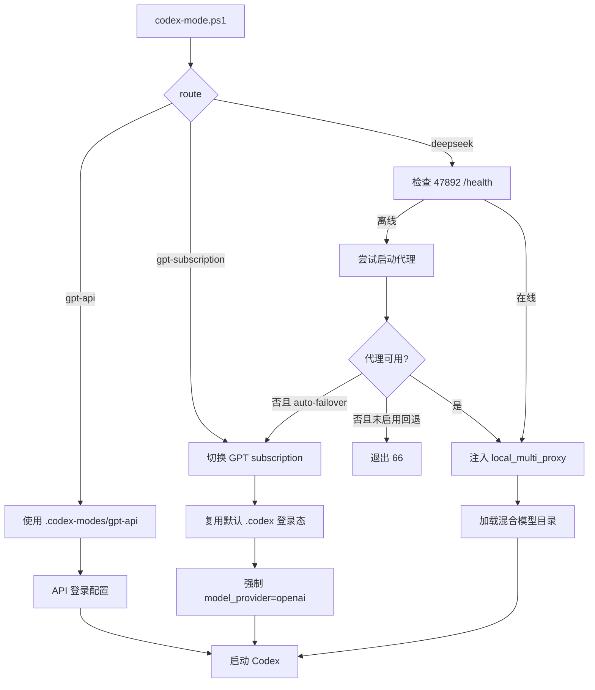
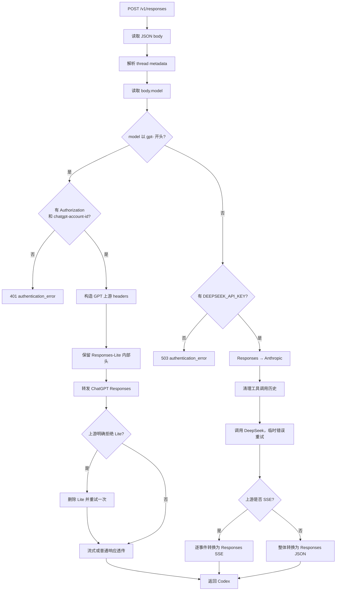
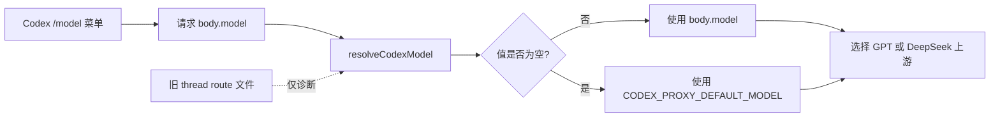
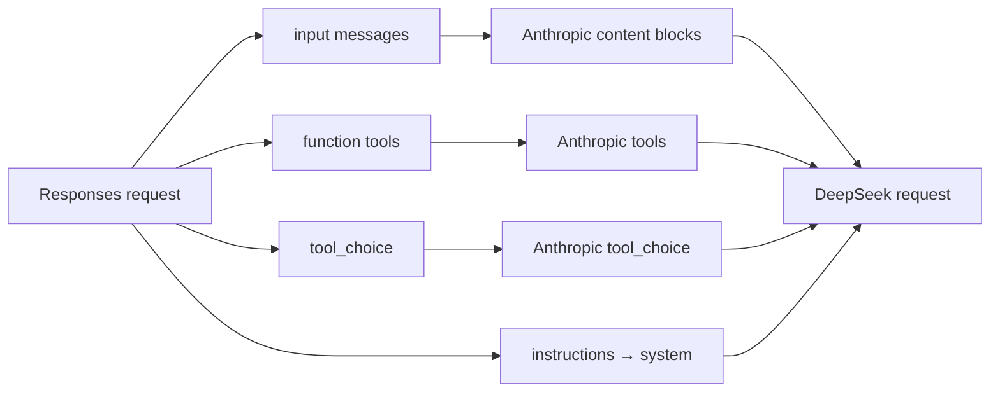
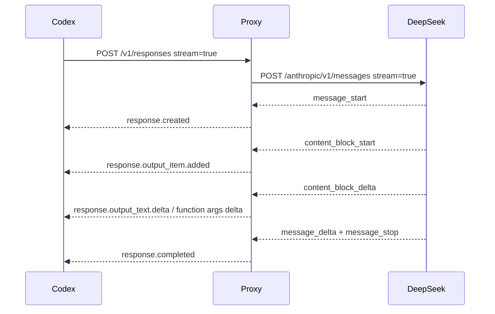
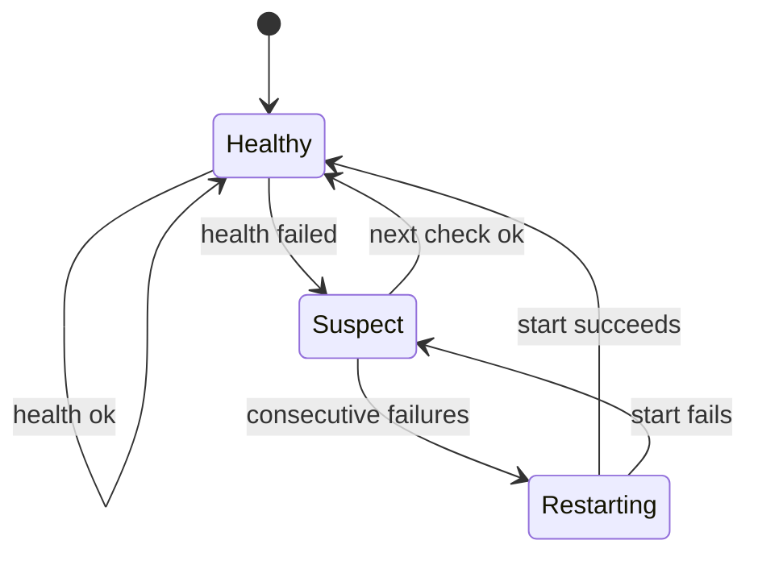
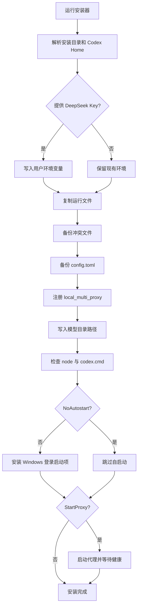

# Codex 多上游代理：架构与流程

本文档描述 `codex-proxy.js` 所实现的当前 Codex 代理。默认监听端口为 `47892`。
仓库中的 `server.js` 和 `FLOW.md` 属于早期 Claude Code `47891` 实现，不在本文
主链路中。

## 1. 组件关系



## 2. 启动模式



### DeepSeek 模式并不限制只能使用 DeepSeek

`deepseek` 是安全包装器中的路由名称。该模式实际把 Codex 接到
`local_multi_proxy`，并加载混合模型目录，所以用户可以从 Codex 原生模型菜单选择
GPT 或 DeepSeek。

## 3. 单次请求路由



## 4. 模型选择规则



当前策略刻意让 Codex 原生 `body.model` 成为唯一模型事实来源。这样可以避免：

- 旧线程状态覆盖用户刚刚选择的新模型。
- 多个窗口共享全局状态造成串线。
- 控制接口与 Codex 原生模型菜单互相竞争。

## 5. GPT 请求头处理

代理只转发必要的 GPT 订阅上下文：

- `authorization`
- `chatgpt-account-id`
- `originator`
- `session-id`
- `thread-id`
- `user-agent`
- `x-client-request-id`
- `x-codex-beta-features`
- `x-codex-turn-metadata`
- `x-codex-window-id`

`x-openai-internal-codex-responses-lite` 默认原样转发。如果 ChatGPT 上游以
`unsupported_value` 明确指出当前模型不支持 Responses Lite，代理会取消该头重试
一次，并在当前进程内缓存该模型的结果。其他错误不会触发此降级，因此支持 Lite 的
模型始终保留原生行为。

## 6. DeepSeek 协议转换

### 请求转换



### 工具历史清理

Anthropic 协议要求 assistant 的 `tool_use` 后面紧跟 user 的匹配
`tool_result`。Codex 可能因上下文裁剪留下孤立调用，或者把 assistant 状态文本放在
工具调用之后。代理会：

1. 将没有匹配结果的 `tool_use` 降级成可读文本。
2. 把普通 assistant 文本移到有效 `tool_use` 前面。
3. 保留匹配的多个 `tool_result` 顺序。
4. 包装 custom tools，并在响应阶段恢复原始调用类型。

### 流式响应转换



## 7. 可用性与故障处理

### 启动前

`codex-safe.ps1` 在 DeepSeek 模式下检查 `/health`。代理不可用时：

- 默认停止启动并返回明确错误。
- 使用 `--auto-failover` 时切换到 GPT 订阅。

### 运行中

DeepSeek 模式会创建后台监控任务，每两秒检查一次健康状态。连续失败达到阈值后：

1. 停止当前 Codex 子进程，防止它继续向故障代理发送请求。
2. 未启用自动回退时提示用户修复并手动恢复。
3. 已启用自动回退时，以 GPT-5.5 和 ChatGPT provider 恢复最近会话。

### 代理进程

Windows 登录启动项运行 `codex-proxy-watchdog.ps1`。watchdog 连续检测到代理离线后，
调用启动脚本恢复服务。`start-codex-proxy.vbs` 用隐藏窗口运行 Node 进程。



## 8. 安装过程



## 9. 接口

| 方法 | 路径 | 行为 |
|---|---|---|
| `GET` | `/health` | 检查代理与 DeepSeek Key |
| `HEAD` | `/v1` | 基础连通性 |
| `GET` | `/v1/models` | 返回 Codex 和 OpenAI 两种目录形状 |
| `POST` | `/v1/responses` | 主路由入口 |
| `GET` | `/v1/responses/:id` | 查询兼容入口 |
| `POST` | `/v1/chat/completions` | Chat Completions 适配 |
| `PUT/GET/DELETE` | `/control/threads/:id/route` | 旧路由状态诊断 |

## 10. 边界与已知限制

1. `/health` 当前以 DeepSeek Key 为整体 ready 条件；GPT 转发可能可用但健康检查仍会
   返回 503。
2. `/control` 没有认证，安全性依赖默认监听 `127.0.0.1`。
3. 自定义端口没有贯穿所有管理脚本，推荐使用默认 `47892`。
4. GPT 订阅依赖 Codex 提供有效的 Authorization 与 account ID。
5. DeepSeek 模型目录声明文本输入；图片能力只声明在 GPT 模型中。
6. `FLOW.md` 是旧版架构文档，不应与本文混用。

## 11. 验证清单

```powershell
# 服务
Invoke-RestMethod http://127.0.0.1:47892/health
Invoke-RestMethod http://127.0.0.1:47892/v1/models

# 核心协议与路由测试
$env:DEEPSEEK_API_KEY = "test-only"
node --test .\test-codex-proxy.js
Remove-Item Env:DEEPSEEK_API_KEY

# 启动参数隔离测试
powershell -NoProfile -ExecutionPolicy Bypass -File .\test-codex-routing.ps1

# 语法
node --check .\codex-proxy.js
```
