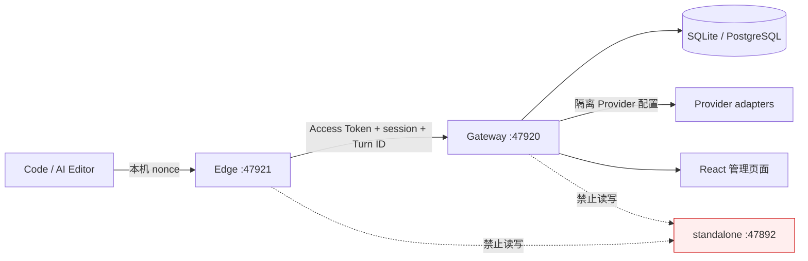
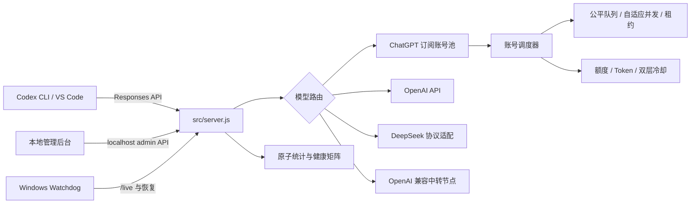
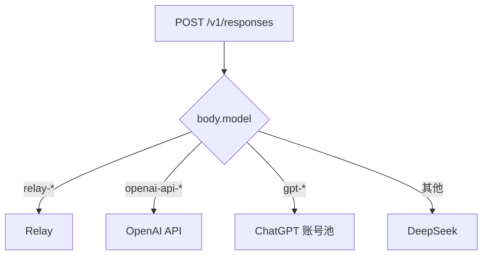

# Codex Proxy 架构说明

本文描述默认监听 `127.0.0.1:47892` 的当前实现。主入口是 `src/server.js`。

## AI Editor Gateway 隔离开发规则

`feature/custom-api-urls@e3ed1d6` 是 Gateway/Edge 的 standalone 兼容基线。后续开发使用
独立分支、端口和数据根：

```text
standalone：127.0.0.1:47892（共享稳定实例，禁止开发任务修改）
gateway：   127.0.0.1:47920
edge：      127.0.0.1:47921
```

Gateway/Edge 不得读取、复制或修改 standalone 的配置、ChatGPT 账号、API Key、统计、
PID、日志或备份。开发启动器必须对端口、PID 和数据目录执行规范化与边界校验；测试使用
临时数据根。AI Editor 的接口事实来源是独立 `My_Code` 仓库中的
`dca68160b25cee78b2c231c4fbd8398624ab93ff` 提交下
`specs/002-ai-editor-account-gateway/contracts/`，两个仓库不合并 Git 根历史。

当前 `feature/ai-editor-account-gateway` 是堆叠分支，依赖
`feature/custom-api-urls@e3ed1d6`。T002–T021 的基础设施与第一轮 Mock、T023–T033
真实认证与安全绑定、T038–T046 模型和流式兼容链路、T049–T055 管理 Webview，以及
T081–T089 Provider 管理已经落地；积分风险和结算仍属于 T061+ 后续阶段。



`tools/start-ai-editor-dev.ps1` 只允许 loopback、拒绝 `47892`，并在
`.ai-editor-dev/` 下创建随机 Edge nonce、PID 元数据和独立数据目录。停止脚本会再次验证
PID 命令行属于当前仓库，再按子进程到父进程的顺序停止；重置脚本要求规范化路径完全一致、
`-Force` 和数据根标记同时成立。启动脚本内建 `/live` 模式校验，只有服务健康后才返回；
超时或进程提前退出时，会回滚本次已经启动的 Gateway/Edge。

Gateway 使用 Fastify、Kysely 和版本化迁移。SQLite 开启 WAL、外键与 busy timeout；
PostgreSQL 通过 `pg.Pool` 接入，同一 repository contract 在两个方言执行。迁移模块统一
把 Windows 路径转换成 `file://` URL，避免 Node 24 将盘符误判为 URL scheme。服务层通过
统一 `inTransaction` API 获取 Kysely transaction，避免业务代码绕过事务边界。

真实认证使用 Authorization Code + PKCE S256 和严格的随机端口 loopback callback。
Gateway 签发 5 分钟 HS256 Access Token 和滚动 30 天单次消费 Refresh Token；数据库只
保存 keyed digest，重放会撤销 Token family 与设备会话。Edge 的 Access Token 只驻留
内存，Refresh Token 通过 DPAPI CurrentUser 或 macOS Keychain 保存。本机 handoff 为
60 秒、内存、单次消费，并在返回 acknowledgement 前先完成安全持久化。

Gateway 的 standalone 兼容适配器在专用 Gateway 进程内复用现有 Provider 路由模块。
`CODEX_PROXY_STORAGE_ROOT` 被绑定到 Gateway 隔离数据根，因此配置、凭据封装、统计、
Provider 健康和线程路由不会落入仓库根或共享 standalone 数据。模型目录依据隔离配置
动态过滤不可用 Provider，并排除 `gpt-mock`。客户端断开后，Gateway 侧转发仍与本地
socket 解耦，给后续 T061+ 结算 hook 保留完成或对账机会。

### 当前架构缺口

- standalone 已完成 N001–N004：全账号检查使用持久化后台任务和批量 patch，健康状态机
  保存连续失败/置信度/恢复证据，用量与重置次数使用独立四态和刷新周期。后续 N005 仍需
  补齐导入批次、负责人、到期、批量归档和通知策略。
- Gateway 的积分、风险和审计表已经迁移，但 `RequestPreflight` 尚未预留 Turn 风险，
  `ResponsesGateway` 尚未结算或对账，`AccountService` 的积分仍是固定零值。
- 组织和邀请码 React 页面仍为占位；跨组织 repository 约束、最后 Level-1 保护和正文
  保留任务未完成。
- Gateway Provider 凭据目前只能以受限的 `plaintext-v1` 用于回环开发。完成
  `envelope-v1`、密钥轮换和迁移前，不具备 production 凭据存储条件。

Gateway/Edge 配置加载对 `NODE_TLS_REJECT_UNAUTHORIZED=0` fail-closed；隔离开发脚本为
两个子进程显式设置安全值，发布门禁也拒绝在禁用 TLS 校验的 Shell 中运行。自定义 CA
只能通过系统信任或 `NODE_EXTRA_CA_CERTS` 接入。

## 组件



| 文件 | 职责 |
|---|---|
| `src/server.js` | HTTP 服务、路由分发、管理 API、单实例和优雅关闭 |
| `src/launcher.js` / `src/mode.js` | standalone 默认入口与显式 Edge 模式选择 |
| `src/edge/` | 本机 nonce、OS 安全存储、一次性 handoff、账号绑定和真实/Mock 转发 |
| `gateway/src/app.ts` | Fastify Gateway、真实认证、账号 API、模型/Responses 路由与 Mock |
| `gateway/src/auth/` | Argon2id、PKCE、授权码、Access/Refresh Token 和账号服务 |
| `gateway/src/routing/` | 预检、动态模型目录和现有 Provider 兼容适配 |
| `gateway/src/providers/` | Level-1 Provider 服务、凭据边界和隔离 ChatGPT 官方登录 |
| `gateway/src/db/` | Kysely schema、SQLite/PostgreSQL 方言、迁移和 repository |
| `gateway/admin-web/` | React/Vite 管理外壳、角色导航、账号页面及 Provider/诊断页面 |
| `tools/*-ai-editor-dev.ps1` | 隔离启动、PID 归属停止和确认式数据重置 |
| `src/routes/chatgpt-sub.js` | ChatGPT 请求、账号轮换、公平队列和取消联动 |
| `src/chatgpt-accounts.js` | OAuth Token、额度、预测、租约、自适应并发和冷却 |
| `src/routes/openai-api.js` | OpenAI Responses / Chat Completions |
| `src/routes/deepseek.js` | Responses 与 Anthropic Messages 双向转换 |
| `src/routes/relay.js` | OpenAI 兼容中转节点 |
| `src/config.js` | 配置加载、原子写入、快照和回滚 |
| `src/migrations.js` | 配置/统计 schema 迁移、未知字段保留和迁移前备份 |
| `src/credential-store.js` | Windows DPAPI 密钥封装与 AES-256-GCM 凭据加密 |
| `src/route-decisions.js` | 最近路由决策的内存环形记录 |
| `src/provider-health.js` | Provider 最近结果、错误和延迟的轻量持久化 |
| `src/stats.js` | Provider/模型/账号健康统计与近期窗口 |
| `src/circuit-breaker.js` | Provider 级熔断和半开恢复 |
| `src/error-guide.js` | HTTP 错误分类、原因和处理建议查找表 |
| `src/diagnostics.js` | 账号池/Provider/熔断联合诊断、结论与上下文操作 |
| `src/smart-routing.js` | 显式回退计划、虚拟模型评分和错误响应延迟提交 |
| `src/pricing.js` | 本地可更新模型价格目录与单请求成本估算 |
| `src/cost-governance.js` | Provider 日/月成本汇总和预算门禁 |
| `src/runtime-info.js` | 运行路径、版本、Commit 和工作区/安装副本一致性 |
| `src/admin.js` | 管理静态资源、基础配置接口与分域接口聚合 |
| `src/admin/login.js` | Codex 来源探测、隔离 OAuth 登录与登录预检 |
| `src/admin/accounts.js` | 账号导入、策略、额度刷新、切换与额度重置 |
| `src/admin/diagnostics.js` | 统计、诊断、价格目录与成本报告 |
| `src/admin/operations.js` | 部署、备份恢复、运行修复和优雅重启 |
| `src/admin_app.js` | 管理后台共享状态、路由和通用交互 |
| `src/admin_modules/` | 账号池、教程、分析和设置页面模块 |
| `src/admin_ui_behaviors.cjs` | 浏览器与 Node DOM 测试共用的交互状态机 |

### 专用管理会话

Code 只加载固定 `/admin#route`，再由 Electron main 在隔离 world 注入 60 秒一次性 ticket。
Gateway 数据库只保存 ticket 和管理 Cookie 的 keyed digest。`POST /api/v1/webview/session`
原子消费 ticket，并设置 30 分钟 `HttpOnly; SameSite=Strict` Cookie；生产环境额外设置
`Secure`。所有 Cookie 写操作要求固定 Gateway `Origin`，关闭标签页时
`DELETE /api/v1/webview/session` 撤销会话。React 导航使用服务端返回的角色许可列表，
普通用户页面只读取自身账号、积分、设备和使用记录。

### Gateway Provider 管理

Provider、凭据、模型路由和诊断接口在每次请求时同时校验 Token/Cookie 身份与数据库中
最新的 `level1` 角色。降权后的旧 Access Token 也无法继续访问。API 永不返回原始凭据，
只返回 `maskedPreview`、`storageFormat`、`updatedAt` 和 `lastUsedAt`；诊断在复用
standalone 健康、熔断和路由决策模块后再次执行 Gateway 脱敏。

数据库 Provider 变更会热更新当前 Gateway 进程内的兼容适配器，不写共享配置文件。
Relay、OpenAI API、DeepSeek 和 ChatGPT 凭据只驱动隔离 `47920` 的模型目录和请求链路。
ChatGPT 官方登录使用 Gateway 数据根下的临时 `CODEX_HOME` 和 Codex app-server；
完成导入后先终止子进程，再删除临时认证目录。MVP `plaintext-v1` 只能用于回环开发，
production/非回环启动门禁会拒绝任何残留明文凭据。

## 请求路由



默认不会在不同 Provider 之间静默切换。ChatGPT 账号池内部可以按策略切换账号；
跨 Provider 回退必须由用户明确配置或启动参数显式启用。

请求级智能路由由 `src/smart-routing.js` 统一执行：

1. 普通模型先按模型前缀确定初始 Provider；默认计划只有一个目标。
2. 用户显式开启后，按 `fallback_chain` 追加具体 Provider + 模型。
3. `auto*` 虚拟模型本身代表用户明确授权，根据健康、额度、延迟和价格排序可用目标。
4. 成功响应一旦写出即保持流式直通；错误响应先在本地缓冲，只有状态和错误类型允许时才丢弃并进入下一目标。
5. 401/402/403、参数和权限错误硬性禁止跨 Provider 回退。
6. 调用上游前检查实际 Provider 预算；`fallback` 跳过超预算线路，`stop` 返回 402。

## ChatGPT 账号生命周期

1. 管理后台通过隔离的 `CODEX_HOME` 启动官方 `codex app-server` OAuth。
2. 登录结果写入账号池，不覆盖当前 `%USERPROFILE%\.codex\auth.json`。
3. 新账号默认“仅保存”；用户启用后才参与路由。
4. Token 刷新采用单飞锁；网络错误可重试，永久凭据错误标记为需要重新登录。
5. 当前本机账号优先从真实 Codex `auth.json` 同步，避免 Refresh Token 双重轮换。
6. 额度从普通模型响应头或低频 usage 请求更新；并发额度刷新会自动合并。
7. 新账号加入后立即尝试首次额度同步；账号名称只作为本地备注，可随时修改。
8. 只有 Access Token 的 CPA/sub2 账号可按临时账号导入；系统记录 Token 到期时间、
   显示倒计时并在到期后自动停止路由；非 Codex OAuth 客户端签发的 Token 会标记为
   不兼容且禁止路由，不会将邮箱 OAuth 或仅能查额度的 Token 误当作可用订阅凭据。
9. 账号用途分为稳定保险池和日抛优先池。日抛候选在同一预留策略内优先于稳定候选，
   且额度保护线固定为 0；稳定账号继续使用全局/账号安全余量。日抛周额度归零会记录
   `disposable_exhausted_at`，7 天内恢复即清除，逾期则写入
   `disposable_discarded_at`、关闭路由并保留记录供人工核对。
10. `pool_tier` 在文件导入或隔离 OAuth 登录会话启动时确定，并随最终凭据一起写入；
    单账号官方登录默认 `stable`，CPA/sub2 批量登录默认 `disposable`。登录会话只保存
    分类枚举，不接收或持久化浏览器中的账号密码。
11. 管理端显式同步和全池低频任务使用 `refreshAccountQuotaSnapshot` 顺序更新 usage 与
    reset-credit；两者独立记录错误，重置次数查询失败不会覆盖最后一次有效计数。
12. `checkChatgptAccountStatus` 使用非消耗式账号端点生成持久化 `health_check`，只在上游
    明确返回 deactivated/suspended/banned 时归类疑似封禁；401、403、429、5xx、超时、
    凭据兼容性和本地额度窗口分别进入可解释状态。实际模型请求的鉴权/限流结果可更新该状态。

## 调度与请求连续性

- 路由策略：`priority`、`round-robin`、`headroom`、`least-used`、`latency`、
  `reliable`、`weighted`、`random`、`lkgp`。
- `lkgp` 按 `session-id` / `thread-id` 粘住最后成功账号。
- 单账号并发上限为 3，并根据成功、429、网络错误和高延迟自适应到 1～3。
- 超限请求进入 FIFO 公平队列，最多等待约 60 秒。
- 账号占用使用可续期租约；过期租约每分钟回收。
- 客户端断开会取消上游请求并释放租约。
- OpenAI、Relay 与 DeepSeek 同样继承客户端取消信号，避免断开后继续消耗。
- 每个请求最多尝试 2 个账号；429 不会在同一账号上重复重试。

响应会附带：

- `X-Codex-Proxy-Request-Id`
- `X-Codex-Proxy-Provider`
- `X-Codex-Proxy-Account`
- `X-Codex-Proxy-Model`
- `X-Codex-Proxy-Latency-Ms`
- `X-Codex-Proxy-Fallback-Attempts`
- `X-Codex-Proxy-Queue-Wait-Ms`
- `X-Codex-Proxy-Queue-Position`

## 额度与冷却

- 默认在剩余 10% 时停止使用账号，安全余量是硬限制。
- 账号可覆盖全局安全余量，并设置北京时间自然日请求/Token 上限。
- 账号可按模型或会话 ID 专用预留；存在匹配预留时优先进入专用账号子池。
- 紧急继续使用以带到期时间的账号字段临时绕过余量和每日上限，最长 24 小时，到期自动失效。
- 用量历史最多保留 7 天/200 个样本，并预测到达安全余量的时间。
- 普通模型限流只冷却“账号 + 模型”；账户/套餐级限流冷却整个账号。
- 冷却最长 7 天，明显异常或过期状态会自动修复。
- 429 不计入 Provider 熔断；网络错误、408 和 5xx 由 Provider 熔断器处理。
- 实际请求与手动 ping 都更新 Provider 健康记录；客户端主动取消不会计为上游故障。
- Provider 与账号事件保留 7 天，按 1h/24h/7d 计算成功率、429 和 P95；熔断开启与账号切换使用独立运维事件统计。
- 自动诊断把账号状态、每日策略、Provider 健康、熔断和 HTTP 错误指南合并为可执行结论。
- `recordUsage` 使用 `model-prices.json` 为每次完成请求增加估算成本，并累计到 Provider、模型和北京时间自然日。
- 价格目录只影响本地估算和预算，不读取真实账单；Relay 与 OpenAI-over-Relay 按实际 Provider 归集。

## 持久化与安全

- `codex-proxy-config.json` 和统计文件使用临时文件、`fsync`、`rename` 原子写入。
- Windows 首次启动生成随机 AES-256-GCM 数据密钥，再由当前用户 DPAPI 保护；配置和账号备份中的 Token/API Key 只落盘密文。
- 设置快照不包含账号、Token 或 API Key；回滚只恢复模型、端点和路由设置。
- 账号删除和恢复前创建独立加密备份；恢复只补回缺失账号，不覆盖当前有效 Token。
- 安装目录 ACL 仅允许当前用户、SYSTEM 和 Administrators。
- 管理写接口要求回环地址，并校验 localhost Host/Origin。
- 请求日志脱敏 Authorization、API Key、Refresh Token 和 JWT，并按 10 MiB 轮转。
- 启动器强制启用 TLS 证书校验。
- 诊断报告不包含 Token、API Key、账号标签或邮箱。
- Gateway Provider API 只允许一级管理员；角色降权立即生效并写拒绝审计。
- `plaintext-v1` 只允许回环开发并持续告警；production 必须先迁移到 `envelope-v1`。

## 存活、就绪与恢复

| 接口 | 含义 |
|---|---|
| `/live` | Node 进程能够响应 |
| `/ready` | 至少有一个已配置上游 |
| `/health` | 向后兼容的 `/ready` |

全局实例锁位于 `%USERPROFILE%\.codex-proxy-instance.json`，防止工作区和安装目录
同时监听端口。收到 `SIGTERM` 后服务停止接收新请求，最长等待约 5 分钟完成现有
连接；Watchdog 使用 `/live` 检测并启动新实例。

## 版本一致性与安全部署

- `runtime-files.json` 是安装器、运行树对比和更新脚本共享的唯一文件清单，运行数据不在其中。
- 安装器和更新脚本生成 `.release-manifest.json`，记录版本、Commit、来源目录、部署时间和逐文件 SHA-256。
- `src/runtime-info.js` 在运行时报告真实入口、PID、启动时间和角色，并逐文件比较工作区与安装目录。
- `update-codex-proxy.ps1` 先备份变化文件，再原子部署并请求优雅重启。
- 部署健康门禁同时校验 `/live`、实际运行路径、Commit 和文件同步状态；任一失败即恢复文件及旧 manifest，并重启旧副本。
- `.last-deployment.json` 记录最近成功或回滚结果，便于后台和脱敏诊断展示。
- 官方登录前分别探测每个 Codex 候选的 `--version` 与 `app-server --help`，同时检查私密浏览器；不再把仅输出 Node.js 版本的损坏 npm 启动器当作可用 CLI。

## 管理与诊断接口

| 方法 | 路径 | 说明 |
|---|---|---|
| `GET` | `/admin/api/diagnostics` | 脱敏运行诊断 |
| `GET` | `/admin/api/diagnosis` | 实时自动诊断、趋势和上下文操作 |
| `GET/PUT` | `/admin/api/prices` | 查询/更新本地模型价格目录 |
| `GET` | `/admin/api/costs` | 成本汇总和预算状态 |
| `GET` | `/admin/api/runtime-info` | 运行版本、路径和部署一致性 |
| `POST` | `/admin/api/deploy-update` | 启动本机安全部署流程 |
| `GET` | `/admin/api/chatgpt-login/preflight` | CLI、OAuth app-server 与浏览器预检 |
| `POST` | `/admin/api/chatgpt-accounts/refresh-usage-all` | 同步全池用量与重置次数 |
| `POST` | `/admin/api/chatgpt-accounts/check-all` | 创建/复用非消耗式账号检查任务 |
| `GET` | `/admin/api/chatgpt-accounts/check-tasks[/:id]` | 最近任务或指定任务进度/结果 |
| `POST` | `/admin/api/chatgpt-accounts/check-tasks/:id/cancel` | 协作式取消任务 |
| `POST` | `/admin/api/chatgpt-accounts/check-tasks/:id/resume` | 从最后批次恢复任务 |
| `GET` | `/admin/api/chatgpt-accounts/:id/health-events` | 脱敏健康状态机历史 |
| `GET` | `/admin/api/config-snapshots` | 配置快照列表 |
| `POST` | `/admin/api/config-rollback` | 回滚快照 |
| `GET` | `/admin/api/account-backups` | 加密账号备份列表 |
| `POST` | `/admin/api/account-backups/restore` | 合并恢复缺失账号 |
| `GET` | `/admin/api/resilience` | Provider 熔断状态 |
| `DELETE` | `/admin/api/resilience` | 重置 Provider 熔断状态 |
| `POST` | `/admin/api/runtime-repair` | 修复异常冷却/租约 |
| `POST` | `/admin/api/proxy/restart` | 优雅重启 |
| `GET/DELETE` | `/admin/api/stats` | 查询/清空统计 |

## 验证

```powershell
npm test
npm run check
git diff --check

Invoke-RestMethod http://127.0.0.1:47892/live
Invoke-RestMethod http://127.0.0.1:47892/ready
Invoke-RestMethod http://127.0.0.1:47892/admin/api/diagnostics
```

自动化测试使用本地 mock，不消耗真实模型额度。
