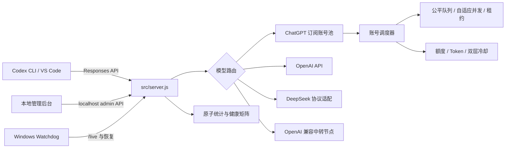
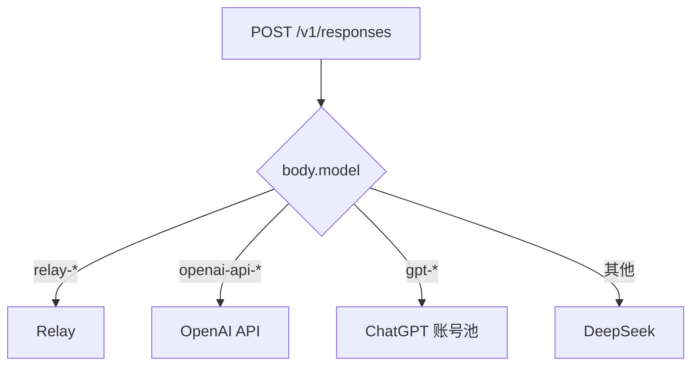

# Codex Proxy 架构说明

本文描述默认监听 `127.0.0.1:47892` 的当前实现。主入口是 `src/server.js`。

## 组件



| 文件 | 职责 |
|---|---|
| `src/server.js` | HTTP 服务、路由分发、管理 API、单实例和优雅关闭 |
| `src/routes/chatgpt-sub.js` | ChatGPT 请求、账号轮换、公平队列和取消联动 |
| `src/chatgpt-accounts.js` | OAuth Token、额度、预测、租约、自适应并发和冷却 |
| `src/routes/openai-api.js` | OpenAI Responses / Chat Completions |
| `src/routes/deepseek.js` | Responses 与 Anthropic Messages 双向转换 |
| `src/routes/relay.js` | OpenAI 兼容中转节点 |
| `src/config.js` | 配置加载、原子写入、快照和回滚 |
| `src/stats.js` | Provider/模型/账号健康统计与近期窗口 |
| `src/circuit-breaker.js` | Provider 级熔断和半开恢复 |
| `src/admin.js` | 本机管理 API、隔离登录、诊断和运维操作 |
| `src/admin_app.js` | 管理后台交互与零基础教程 |

## 请求路由



默认不会在不同 Provider 之间静默切换。ChatGPT 账号池内部可以按策略切换账号；
跨 Provider 回退必须由用户明确配置或启动参数显式启用。

## ChatGPT 账号生命周期

1. 管理后台通过隔离的 `CODEX_HOME` 启动官方 `codex app-server` OAuth。
2. 登录结果写入账号池，不覆盖当前 `%USERPROFILE%\.codex\auth.json`。
3. 新账号默认“仅保存”；用户启用后才参与路由。
4. Token 刷新采用单飞锁；网络错误可重试，永久凭据错误标记为需要重新登录。
5. 当前本机账号优先从真实 Codex `auth.json` 同步，避免 Refresh Token 双重轮换。
6. 额度从普通模型响应头或低频 usage 请求更新；并发额度刷新会自动合并。

## 调度与请求连续性

- 路由策略：`priority`、`round-robin`、`headroom`、`least-used`、`latency`、
  `reliable`、`weighted`、`random`、`lkgp`。
- `lkgp` 按 `session-id` / `thread-id` 粘住最后成功账号。
- 单账号并发上限为 3，并根据成功、429、网络错误和高延迟自适应到 1～3。
- 超限请求进入 FIFO 公平队列，最多等待约 60 秒。
- 账号占用使用可续期租约；过期租约每分钟回收。
- 客户端断开会取消上游请求并释放租约。
- 每个请求最多尝试 2 个账号；429 不会在同一账号上重复重试。

响应会附带：

- `X-Codex-Proxy-Request-Id`
- `X-Codex-Proxy-Provider`
- `X-Codex-Proxy-Account`
- `X-Codex-Proxy-Model`
- `X-Codex-Proxy-Latency-Ms`
- `X-Codex-Proxy-Fallback-Attempts`
- `X-Codex-Proxy-Queue-Wait-Ms`
- `X-Codex-Proxy-Queue-Position`

## 额度与冷却

- 默认在剩余 10% 时停止使用账号，安全余量是硬限制。
- 用量历史最多保留 7 天/200 个样本，并预测到达安全余量的时间。
- 普通模型限流只冷却“账号 + 模型”；账户/套餐级限流冷却整个账号。
- 冷却最长 7 天，明显异常或过期状态会自动修复。
- 429 不计入 Provider 熔断；网络错误、408 和 5xx 由 Provider 熔断器处理。

## 持久化与安全

- `codex-proxy-config.json` 和统计文件使用临时文件、`fsync`、`rename` 原子写入。
- 管理配置、账号路由、节点和切换操作前自动创建配置快照，最多保留 10 份。
- 安装目录 ACL 仅允许当前用户、SYSTEM 和 Administrators。
- 管理写接口要求回环地址，并校验 localhost Host/Origin。
- 请求日志脱敏 Authorization、API Key、Refresh Token 和 JWT，并按 10 MiB 轮转。
- 启动器强制启用 TLS 证书校验。
- 诊断报告不包含 Token、API Key、账号标签或邮箱。

## 存活、就绪与恢复

| 接口 | 含义 |
|---|---|
| `/live` | Node 进程能够响应 |
| `/ready` | 至少有一个已配置上游 |
| `/health` | 向后兼容的 `/ready` |

全局实例锁位于 `%USERPROFILE%\.codex-proxy-instance.json`，防止工作区和安装目录
同时监听端口。收到 `SIGTERM` 后服务停止接收新请求，最长等待约 5 分钟完成现有
连接；Watchdog 使用 `/live` 检测并启动新实例。

## 管理与诊断接口

| 方法 | 路径 | 说明 |
|---|---|---|
| `GET` | `/admin/api/diagnostics` | 脱敏运行诊断 |
| `GET` | `/admin/api/config-snapshots` | 配置快照列表 |
| `POST` | `/admin/api/config-rollback` | 回滚快照 |
| `POST` | `/admin/api/runtime-repair` | 修复异常冷却/租约 |
| `POST` | `/admin/api/proxy/restart` | 优雅重启 |
| `GET/DELETE` | `/admin/api/stats` | 查询/清空统计 |

## 验证

```powershell
npm test
npm run check
git diff --check

Invoke-RestMethod http://127.0.0.1:47892/live
Invoke-RestMethod http://127.0.0.1:47892/ready
Invoke-RestMethod http://127.0.0.1:47892/admin/api/diagnostics
```

自动化测试使用本地 mock，不消耗真实模型额度。
