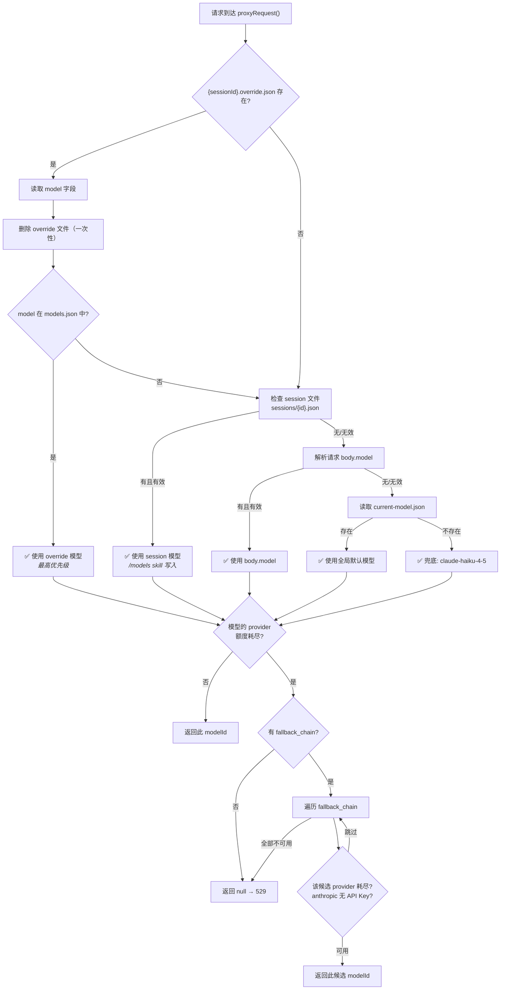
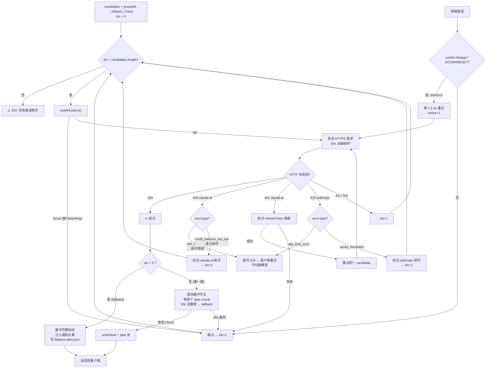

# 模型路由流程

用户发消息 → Claude Code → proxy(localhost:47891) 收到请求 → 开始路由

## 一、模型选择（resolveModelId）



## 二、候选链发送（proxyRequest 迭代）



## 三、优先级总结

```
本次请求的模型优先级（从高到低）：
  1. override.json     ← auto-model skill 写入，一次性用完即删
  2. session 文件       ← /models skill 写入，持久生效
  3. request body.model ← Agent 工具的 model 参数
  4. current-model.json ← 全局默认
  5. claude-haiku-4-5   ← 硬兜底

发送时的渠道优先级（以 claude-sonnet-4-6 为例）：
  1. claude-ai (订阅 Bearer Token, 自动刷新)
  2. claude-sonnet-4-6-api (Anthropic API Key)
  3. deepseek-v4-pro (DeepSeek)
  4. 529 错误
```
