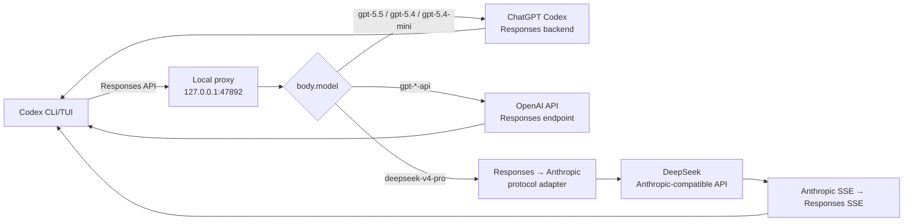

# Codex Local Multi-Upstream Proxy

Windows 上的 Codex CLI / VS Code 多上游路由代理。它在保留原生 Responses API、
工具调用和流式输出的同时，统一接入 ChatGPT 订阅账号池、OpenAI API、DeepSeek
和 OpenAI 兼容中转节点，并提供本地管理后台、稳定性保护与可观测性。

## 主要能力

- ChatGPT 账号池按 5 小时/每周剩余额度选择账号，低额度账号自动避让。
- 同一 `session-id` / `thread-id` 默认粘住最后成功账号，兼顾上下文缓存和稳定性。
- 账号池支持优先级、轮询、额度、最少使用、延迟、可靠性、权重、随机和最后成功路径 9 种可选策略。
- 管理后台支持拖拽调整账号优先级，并可设置每账号路由权重和低额度阈值。
- 新登录或手动导入的账号可设为“仅保存”，不会切换本机 Codex，也不会参与代理路由；需要时可单独启用。
- 合规稳定模式限制单账号并发为 3、忙碌请求进入本地等待队列、单请求最多尝试 2 个账号，并优先使用 30 分钟内的新鲜额度数据。
- 并发会根据成功、429、网络错误和高延迟在 1～3 之间自适应；请求槽位使用可续期租约，断连或异常退出后可自动回收。
- Token 刷新和额度刷新均使用单飞合并，区分临时网络错误与必须重新登录的永久凭据错误。
- 额度历史会生成到达安全余量的趋势预测，并支持模型级、账号级双层冷却。
- 提供优雅重启、全局单实例锁、配置快照回滚、脱敏诊断报告和异常状态自动修复。
- 额度优先从真实模型响应头更新；后台仅刷新参与路由的账号，全池约 30 分钟、当前账号最低约 5 分钟，并带随机抖动与失败退避。
- 408、5xx 和网络错误由轻量 Provider Circuit Breaker 隔离，并支持半开自动恢复。
- 响应附带 `X-Codex-Proxy-Request-Id`、Provider、Account、Model、Latency 和 Fallback 元数据。
- 管理后台健康矩阵展示每账号剩余额度、成功率、请求数、429、最近状态以及 P50/P95/平均延迟。
- 日志自动脱敏常见 Token/API Key/JWT，配置使用同目录原子写入。
- 在 Codex 模型菜单中提供 `gpt-5.5`、`gpt-5.4`、`gpt-5.4-mini`、
  `GPT-5.5-API`、`GPT-5.4-API`、`GPT-5.4-API Mini` 和 `deepseek-v4-pro`。
- GPT 订阅请求使用 Codex 已有的 ChatGPT 登录态转发到 ChatGPT Responses 后端。
- GPT `*-API` 请求使用 `OPENAI_API_KEY` 转发到 OpenAI API。
- DeepSeek 请求在 OpenAI Responses 与 Anthropic Messages 协议之间双向转换。
- 支持文本、流式输出、function tools、custom tools、工具调用历史和 token usage。
- 修复历史裁剪造成的孤立 `tool_use`，并保证 `tool_result` 紧跟对应工具调用。
- 自动重试临时网络错误。
- 提供健康检查、请求日志、后台启动、Windows 登录自启动和运行期监控。
- 支持 DeepSeek、GPT 订阅、GPT API 三种显式启动模式。
- 默认不静默切换供应商；只有显式启用 `--auto-failover` 才自动回退。

## 工作原理



Codex 发往代理的 `body.model` 是实际路由依据。旧的线程路由文件仅保留用于诊断，
不会覆盖 Codex 原生模型选择。

### GPT 订阅路由

普通 GPT 模型（`gpt-5.5`、`gpt-5.4`、`gpt-5.4-mini`）保持 Responses API 格式。代理转发 Codex 提供的订阅鉴权、账户、线程和
客户端元数据，然后把上游流直接返回给 Codex。

代理首次会向 ChatGPT 上游保留
`X-OpenAI-Internal-Codex-Responses-Lite`。如果上游明确返回该模型不支持 Lite 的
`unsupported_value`，代理会自动取消 Lite 并重试一次，同时在当前进程内记住该
模型不支持 Lite。其他 400 错误不会触发降级。

### GPT API 路由

带 `-API` 后缀的模型通过 OpenAI API Key 调用，不使用 ChatGPT 订阅登录态。菜单显示名保持 `GPT-*-API`，内部 slug 使用 `openai-api-gpt-*`，避免 Codex 在 ChatGPT 登录态下把未知 `gpt-*` 名称提前拦截：

| 菜单显示 | 模型 slug | 上游 API model |
|---|---|---|
| `GPT-5.5-API` | `openai-api-gpt-5.5` | `gpt-5.5` |
| `GPT-5.4-API` | `openai-api-gpt-5.4` | `gpt-5.4` |
| `GPT-5.4-API Mini` | `openai-api-gpt-5.4-mini` | `gpt-5.4-mini` |

使用这些模型前需要设置 `OPENAI_API_KEY`。可选设置
`CODEX_OPENAI_API_BASE_URL`、`CODEX_OPENAI_API_RESPONSES_URL` 或
`CODEX_OPENAI_API_CHAT_COMPLETIONS_URL` 指向兼容端点。

### DeepSeek 路由

DeepSeek 路由执行以下转换：

1. 解析 Codex Responses 请求。
2. 把 instructions、messages、tools 和 tool choice 转成 Anthropic Messages。
3. 清理被截断历史中的孤立工具调用。
4. 调用 DeepSeek Anthropic 兼容接口。
5. 把普通响应或 SSE 流转换回 Responses API 事件。

## 系统要求

- Windows 10/11
- PowerShell 5.1 或更高版本
- Node.js 20 或更高版本
- 已安装 Codex CLI，`codex.cmd` 可从 `PATH` 访问
- 使用 GPT 订阅模式时，已通过 Codex 完成 ChatGPT 登录
- 使用 GPT `*-API` 模型时，有有效的 `OPENAI_API_KEY`
- 使用 DeepSeek 时，有有效的 `DEEPSEEK_API_KEY`

## 安装

### 1. 克隆仓库

```powershell
git clone https://github.com/OscarYi9527/codex_proxy.git
cd codex_proxy
```

### 2. 预览安装操作

```powershell
powershell -NoProfile -ExecutionPolicy Bypass -File `
  .\install-codex-local-multi-proxy.ps1 -DryRun
```

### 3. 安装并启动

推荐让安装器持久化 DeepSeek Key、配置 Codex、安装登录自启动并立即启动代理：

```powershell
powershell -NoProfile -ExecutionPolicy Bypass -File `
  .\install-codex-local-multi-proxy.ps1 `
  -DeepSeekApiKey "你的 DeepSeek API Key" `
  -OpenAIApiKey "你的 OpenAI API Key（可选，用于 GPT-*-API）" `
  -StartProxy
```

如果还需要 VS Code Codex 扩展也能在模型菜单中选择 `deepseek-v4-pro`，可以一键安装 VS Code 兼容层并 patch 扩展前端模型过滤：

```powershell
powershell -NoProfile -ExecutionPolicy Bypass -File `
  .\install-codex-local-multi-proxy.ps1 `
  -DeepSeekApiKey "你的 DeepSeek API Key" `
  -StartProxy `
  -InstallVSCodeCompat `
  -PatchVSCodeWebview
```

> `-PatchVSCodeWebview` 会修改本机 VS Code OpenAI/Codex 扩展的 `model-list-filter-*.js`，升级扩展后可能需要重新执行安装器。

默认安装目录：

```text
%USERPROFILE%\.codex-local-multi-proxy
```

安装器会：

1. 复制运行文件到安装目录。
2. 在覆盖已有文件前创建时间戳备份。
3. 可选持久化 `DEEPSEEK_API_KEY` 和 `OPENAI_API_KEY` 到用户环境变量。
4. 备份并更新 `%USERPROFILE%\.codex\config.toml`。
5. 注册 `local_multi_proxy`，地址为 `http://localhost:47892/v1`。
6. 为 `local_multi_proxy` 写入 `requires_openai_auth = true`，确保官方 Codex 桌面应用仍能显示 ChatGPT 账号信息。
7. 安装 Windows 登录自启动 watchdog。
8. 在使用 `-StartProxy` 时立即启动代理。
9. 在使用 `-InstallVSCodeCompat` 时生成 VS Code launcher 并更新 `chatgpt.cliExecutable`。

不需要登录自启动：

```powershell
powershell -NoProfile -ExecutionPolicy Bypass -File `
  .\install-codex-local-multi-proxy.ps1 `
  -DeepSeekApiKey "你的 DeepSeek API Key" `
  -NoAutostart -StartProxy
```

自定义安装目录或端口：

```powershell
powershell -NoProfile -ExecutionPolicy Bypass -File `
  .\install-codex-local-multi-proxy.ps1 `
  -InstallDir "D:\Tools\codex-proxy" `
  -Port 47892 `
  -DeepSeekApiKey "你的 DeepSeek API Key" `
  -StartProxy
```

> 当前启动、停止和安全包装脚本默认使用端口 `47892`。如果修改安装端口，应同步
> 修改这些脚本或保持默认值。

### 4. 验证

```powershell
Invoke-RestMethod http://127.0.0.1:47892/live
Invoke-RestMethod http://127.0.0.1:47892/ready
Invoke-RestMethod http://127.0.0.1:47892/v1/models
```

健康响应示例：

```json
{
  "status": "ok",
  "provider": "deepseek",
  "port": 47892
}
```

## 使用

### 使用本地多上游代理

```powershell
powershell -ExecutionPolicy Bypass -File `
  "$HOME\.codex-local-multi-proxy\codex-mode.ps1" deepseek
```

虽然模式名是 `deepseek`，该模式加载的是混合模型目录，因此可以在 Codex 内部通过
模型菜单切换 GPT 与 DeepSeek。

### 直接使用 GPT 订阅

```powershell
powershell -ExecutionPolicy Bypass -File `
  "$HOME\.codex-local-multi-proxy\codex-mode.ps1" gpt-subscription
```

该模式复用默认 `%USERPROFILE%\.codex` 的 ChatGPT 登录态，并显式覆盖可能残留的
本地代理 provider。

### 使用独立 GPT API 配置

```powershell
powershell -ExecutionPolicy Bypass -File `
  "$HOME\.codex-local-multi-proxy\codex-mode.ps1" gpt-api
```

该模式使用 `%USERPROFILE%\.codex-modes\gpt-api`，避免 API 登录与 ChatGPT
订阅登录互相覆盖。

### 自动故障转移

默认情况下代理离线会终止当前 DeepSeek Codex 子进程，不会偷偷改变供应商。
如确实需要自动切到 GPT 订阅：

```powershell
powershell -ExecutionPolicy Bypass -File `
  "$HOME\.codex-local-multi-proxy\codex-safe.ps1" `
  --route deepseek --auto-failover
```

## 服务管理

手动启动：

```powershell
powershell -ExecutionPolicy Bypass -File `
  "$HOME\.codex-local-multi-proxy\start-codex-proxy.ps1"
```

停止：

```powershell
powershell -ExecutionPolicy Bypass -File `
  "$HOME\.codex-local-multi-proxy\stop-codex-proxy.ps1"
```

安装或卸载自启动：

```powershell
powershell -ExecutionPolicy Bypass -File `
  "$HOME\.codex-local-multi-proxy\install-codex-proxy-autostart.ps1"

powershell -ExecutionPolicy Bypass -File `
  "$HOME\.codex-local-multi-proxy\uninstall-codex-proxy-autostart.ps1"
```

## HTTP 接口

| 方法 | 路径 | 用途 |
|---|---|---|
| `GET` | `/live` | 进程存活检查 |
| `GET` | `/ready` | 至少一个上游可用的就绪检查 |
| `GET` | `/health` | 向后兼容的就绪检查 |
| `HEAD` | `/v1` | provider 连通性检查 |
| `GET` | `/v1/models` | Codex/OpenAI 兼容模型目录 |
| `POST` | `/v1/responses` | 主 Responses API |
| `GET` | `/v1/responses/:id` | Responses 查询兼容接口 |
| `POST` | `/v1/chat/completions` | Chat Completions 兼容入口 |
| `PUT/GET/DELETE` | `/control/threads/:id/route` | 旧线程路由诊断接口 |
| `GET` | `/admin` | 管理后台 Web 界面 |
| `GET` | `/admin/api/config` | 获取当前配置（密钥掩码） |
| `PUT` | `/admin/api/config` | 保存配置并热重载 |
| `GET` | `/admin/api/stats` | 获取 Provider、模型和账号健康统计 |
| `GET` | `/admin/api/diagnostics` | 获取不含 Token/邮箱的本地诊断报告 |
| `GET` | `/admin/api/config-snapshots` | 列出最近配置快照 |
| `POST` | `/admin/api/config-rollback` | 回滚所选配置快照 |
| `POST` | `/admin/api/runtime-repair` | 清理异常冷却与过期租约 |
| `POST` | `/admin/api/proxy/restart` | 优雅重启代理 |

控制接口只应通过 localhost 使用，不要把代理监听地址暴露到公网。

## 配置

主要环境变量：

| 变量 | 默认值 | 说明 |
|---|---|---|
| `DEEPSEEK_API_KEY` | 无 | DeepSeek 鉴权，使用 DeepSeek 时必需 |
| `OPENAI_API_KEY` | 无 | GPT `*-API` 模型鉴权 |
| `OPENAI_ORG_ID` | 无 | 可选 OpenAI Organization header |
| `OPENAI_PROJECT_ID` | 无 | 可选 OpenAI Project header |
| `DEEPSEEK_ANTHROPIC_URL` | DeepSeek 官方 Anthropic 兼容地址 | DeepSeek 上游 |
| `CODEX_CHATGPT_RESPONSES_URL` | ChatGPT Codex Responses 地址 | GPT 订阅上游 |
| `CODEX_OPENAI_API_BASE_URL` | `https://api.openai.com/v1` | GPT API 上游 base URL |
| `CODEX_OPENAI_API_RESPONSES_URL` | `${CODEX_OPENAI_API_BASE_URL}/responses` | GPT API Responses 上游 |
| `CODEX_OPENAI_API_CHAT_COMPLETIONS_URL` | `${CODEX_OPENAI_API_BASE_URL}/chat/completions` | GPT API Chat Completions 上游 |
| `CODEX_PROXY_HOST` | `127.0.0.1` | 本地监听地址 |
| `CODEX_PROXY_PORT` | `47892` | 本地监听端口 |
| `CODEX_PROXY_DEFAULT_MODEL` | `deepseek-v4-pro` | 请求未指定模型时的默认值 |
| `CODEX_SAFE_AUTO_FAILOVER` | `0` | 设为 `1` 启用自动 GPT 回退 |
| `CODEX_ROUTE` | `deepseek` | `codex-safe.ps1` 默认启动路由 |


### 配置文件方式（无需修改环境变量）

将 codex-proxy-config.json 放在代理安装目录下，即可覆盖默认 API 地址，无需修改系统环境变量。

优先级：**环境变量 > 配置文件 > 内置默认值**


### 管理后台 Web 界面

代理启动后访问 http://127.0.0.1:47892/admin 打开管理后台。

功能：
- 可视化编辑 API 地址、密钥、默认模型和中转节点
- ChatGPT 官方隔离登录、账号仅保存/启用、拖拽优先级和 9 种路由策略
- 5 小时/每周额度、趋势预测、1h/24h 成功率、P50/P95 延迟和双层冷却
- 自适应并发、等待队列、请求租约、配置快照回滚和优雅重启
- 零基础使用教程，以及一键生成不含凭据和邮箱的诊断报告

用量统计 API：
| 方法 | 路径 | 说明 |
|---|---|---|
| `GET` | `/admin/api/stats` | 获取所有用量统计 |
| `DELETE` | `/admin/api/stats` | 重置用量统计 |

统计维度：
- 按 provider 分组：`chatgpt`、`openai-api`、`deepseek`
- 每 provider 包含：请求数、输入/输出 token 数
- 每 provider 按 model 细分统计
- 数据自动每 30 秒持久化到 `codex-proxy-stats.json`

API 端点：
| 方法 | 路径 | 说明 |
|---|---|---|
| GET | /admin | 管理后台 HTML 页面 |
| GET | /admin/api/config | 获取当前配置（密钥已掩码） |
| PUT | /admin/api/config | 保存配置到文件并热重载 |

配置文件支持以下字段（均可通过管理后台修改）：
| 字段 | 说明 |
|---|---|
| chatgpt_responses_url | ChatGPT 订阅鉴权转发地址 |
| upstream_url | DeepSeek Anthropic 兼容 API 地址 |
| deepseek_api_key | DeepSeek API 密钥 |
| openai_api_base_url | OpenAI API Base URL |
| openai_api_key | OpenAI API 密钥 |
| openai_org_id | OpenAI Organization ID（可选） |
| openai_project_id | OpenAI Project ID（可选） |
| openai_api_responses_url | OpenAI Responses 地址（可选） |
| openai_api_chat_completions_url | OpenAI Chat Completions 地址（可选） |
| default_model | 默认模型 |


```json
{
  "chatgpt_responses_url": "https://your-custom-chatgpt.com/backend-api/codex/responses",
  "upstream_url": "https://your-custom-deepseek.com/anthropic/v1/messages",
  "openai_api_base_url": "https://your-custom-openai.com/v1"
}
```


模型能力位于 `codex-models.json`。Codex provider 配置示例：

```toml
model = "gpt-5.5"
model_provider = "local_multi_proxy"
model_catalog_json = "C:\\Users\\you\\.codex-local-multi-proxy\\codex-models.json"

[model_providers.local_multi_proxy]
name = "Local Multi-Upstream Proxy"
base_url = "http://localhost:47892/v1"
wire_api = "responses"
requires_openai_auth = true
```

`requires_openai_auth = true` 很重要：Codex 桌面应用的账号/Profile UI 会通过 app-server 的 `account/read` 判断是否有 ChatGPT 账号。如果自定义 provider 没有声明需要 OpenAI auth，官方应用可能返回 `account: null`，导致 GPT 仍可用但右上角账号信息不显示。

## 日志和诊断

安装目录中的主要运行文件：

| 文件 | 内容 |
|---|---|
| `codex-proxy.log` | 服务标准输出 |
| `codex-proxy.error.log` | 服务错误输出 |
| `%USERPROFILE%\.claude\proxy\codex-proxy-requests.log` | 已脱敏请求日志（自动轮转） |
| `.codex-proxy.pid` | 当前代理 PID |
| `codex-proxy-watchdog.log` | watchdog 恢复记录 |

常用诊断命令：

```powershell
Get-Content "$HOME\.claude\proxy\codex-proxy-requests.log" -Tail 50
Get-Content "$HOME\.codex-local-multi-proxy\codex-proxy.error.log" -Tail 50
Get-Process -Id (Get-Content "$HOME\.codex-local-multi-proxy\.codex-proxy.pid")
```

## 测试

```powershell
npm test
npm run check
git diff --check
```

自动化测试使用本地 mock，不会消耗真实模型额度。

## 常见问题

### `X-OpenAI-Internal-Codex-Responses-Lite` 不支持

确保运行的是包含 Lite 自适应重试逻辑的最新版代理，并重启旧进程。代理会先保留
Lite；仅在上游明确拒绝时改用标准 Responses：

```powershell
.\stop-codex-proxy.ps1
.\start-codex-proxy.ps1
```

### `/ready` 或 `/health` 返回 503

这表示进程仍可能存活，但尚未配置可用上游。先检查 `/live`；再在管理后台确认至少
一个 ChatGPT 账号已启用且高于安全余量，或者 OpenAI/DeepSeek/中转节点已配置。

### ChatGPT 账号池返回 503

管理后台会区分账号忙碌、冷却、模型冷却、登录失效和达到安全余量。短时并发会进入
公平等待队列；若所有账号都不可用，请启用一个有额度且属于你的账号，或等待冷却/
额度窗口恢复。不要通过频繁登录、刷新或重试制造请求风暴。

### GPT 提示缺少订阅鉴权头

先使用默认 Codex Home 登录 ChatGPT，然后通过 `gpt-subscription` 或混合代理启动。
不要把 GPT 订阅模式指向一个没有登录状态的独立 `CODEX_HOME`。

### GPT API 模型提示 “not supported when using Codex with a ChatGPT account”

不要把 API 模型的目录 slug 暴露成未知的 `gpt-*` 名称。Codex 在 ChatGPT 登录态下会先按 ChatGPT 账号校验 `gpt-*` 模型，未命中官方模型时请求不会到达本地代理。当前目录使用 `openai-api-gpt-*` 作为内部 slug，菜单显示名仍是 `GPT-*-API`。

### 官方 Codex 应用不显示账号信息

确保 `[model_providers.local_multi_proxy]` 中包含：

```toml
requires_openai_auth = true
```

修复后需要重启官方 Codex 桌面应用，让内置 app-server 重新读取配置。可用临时 app-server 验证：`account/read` 应返回 ChatGPT 邮箱和 `requiresOpenaiAuth: true`。

### VS Code Codex 看不到或无法选择 deepseek

重新执行：

```powershell
powershell -NoProfile -ExecutionPolicy Bypass -File `
  .\install-codex-local-multi-proxy.ps1 `
  -InstallVSCodeCompat `
  -PatchVSCodeWebview
```

VS Code 兼容层会把 `chatgpt.cliExecutable` 指向 `codex-vscode-launcher.exe`，并在前端模型过滤中同时加入 `models` 和 `availableModels`，否则 deepseek 可能显示但不能生效。

如果旧安装器提示 `VS Code settings are not plain JSON`，说明 VS Code 的 `settings.json` 使用了注释或尾随逗号。新版安装器已支持 JSONC；更新仓库后重新执行安装器即可。临时手动修复方式是在 VS Code 设置 JSON 中加入：

```jsonc
"chatgpt.cliExecutable": "C:\\Users\\你的用户名\\.codex-local-multi-proxy\\codex-vscode-launcher.exe"
```

## 仓库结构

- `src/server.js`：HTTP 服务、模型路由和管理 API 入口。
- `src/chatgpt-accounts.js`：账号池、额度、Token、并发租约和冷却。
- `src/routes/`：ChatGPT、OpenAI API、DeepSeek 和中转节点处理器。
- `src/admin.html` / `src/admin_app.js`：本地管理后台和新手教程。
- `codex-models.json`：Codex 模型目录。
- `codex-safe.ps1`：安全启动、模式隔离、监控和故障转移。
- `codex-mode.ps1`：三种路由模式的简化入口。
- `install-codex-local-multi-proxy.ps1`：一键安装器，可选安装 VS Code 兼容层。
- `install-vscode-codex-compat.ps1`：生成 VS Code launcher，并可 patch VS Code Codex 模型菜单。
- `repair-codex-model-cache.ps1`：旧版官方应用模型缓存修复辅助脚本。
- `start/stop-codex-proxy.ps1`：服务管理。
- `codex-proxy-watchdog.ps1`：登录自启动后的守护进程。
- `ARCHITECTURE.md`：详细组件、数据流和流程图。

## 相关文档

- [架构说明](ARCHITECTURE.md)
- [安全说明](SECURITY.md)
- [后续计划](TODO.md)

## 安全说明

- 默认只监听 `127.0.0.1`。
- 日志不记录完整 Authorization 或 API Key。
- 不要提交任何真实 API Key、Codex 登录文件或运行日志。
- 不要把 `/control` 接口暴露到不可信网络。
- 只使用自己拥有且获准使用的账号；本项目不提供设备指纹伪造、验证码代收或平台
  风控规避能力。
- 启动器强制开启 TLS 证书校验；如本地代理使用自定义 CA，应配置受信任 CA，而不是
  全局关闭证书校验。
