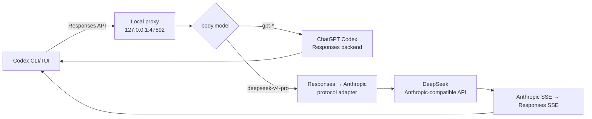

# Codex Local Multi-Upstream Proxy

Windows 上的 Codex CLI 多上游路由代理。它让一个 Codex 窗口在保留原生
Responses API、工具调用和流式输出的同时，在 ChatGPT 订阅模型与 DeepSeek
之间切换。

## 主要能力

- 在 Codex 模型菜单中提供 `gpt-5.5`、`gpt-5.4`、`gpt-5.4-mini` 和
  `deepseek-v4-pro`。
- GPT 请求使用 Codex 已有的 ChatGPT 登录态转发到 ChatGPT Responses 后端。
- DeepSeek 请求在 OpenAI Responses 与 Anthropic Messages 协议之间双向转换。
- 支持文本、流式输出、function tools、custom tools、工具调用历史和 token usage。
- 修复历史裁剪造成的孤立 `tool_use`，并保证 `tool_result` 紧跟对应工具调用。
- 自动重试临时网络错误。
- 提供健康检查、请求日志、后台启动、Windows 登录自启动和运行期监控。
- 支持 DeepSeek、GPT 订阅、GPT API 三种显式启动模式。
- 默认不静默切换供应商；只有显式启用 `--auto-failover` 才自动回退。

## 工作原理



Codex 发往代理的 `body.model` 是实际路由依据。旧的线程路由文件仅保留用于诊断，
不会覆盖 Codex 原生模型选择。

### GPT 路由

GPT 请求保持 Responses API 格式。代理转发 Codex 提供的订阅鉴权、账户、线程和
客户端元数据，然后把上游流直接返回给 Codex。

代理首次会向 ChatGPT 上游保留
`X-OpenAI-Internal-Codex-Responses-Lite`。如果上游明确返回该模型不支持 Lite 的
`unsupported_value`，代理会自动取消 Lite 并重试一次，同时在当前进程内记住该
模型不支持 Lite。其他 400 错误不会触发降级。

### DeepSeek 路由

DeepSeek 路由执行以下转换：

1. 解析 Codex Responses 请求。
2. 把 instructions、messages、tools 和 tool choice 转成 Anthropic Messages。
3. 清理被截断历史中的孤立工具调用。
4. 调用 DeepSeek Anthropic 兼容接口。
5. 把普通响应或 SSE 流转换回 Responses API 事件。

## 系统要求

- Windows 10/11
- PowerShell 5.1 或更高版本
- Node.js 20 或更高版本
- 已安装 Codex CLI，`codex.cmd` 可从 `PATH` 访问
- 使用 GPT 订阅模式时，已通过 Codex 完成 ChatGPT 登录
- 使用 DeepSeek 时，有有效的 `DEEPSEEK_API_KEY`

## 安装

### 1. 克隆仓库

```powershell
git clone https://github.com/OscarYi9527/codex_proxy.git
cd codex_proxy
```

### 2. 预览安装操作

```powershell
powershell -NoProfile -ExecutionPolicy Bypass -File `
  .\install-codex-local-multi-proxy.ps1 -DryRun
```

### 3. 安装并启动

推荐让安装器持久化 DeepSeek Key、配置 Codex、安装登录自启动并立即启动代理：

```powershell
powershell -NoProfile -ExecutionPolicy Bypass -File `
  .\install-codex-local-multi-proxy.ps1 `
  -DeepSeekApiKey "你的 DeepSeek API Key" `
  -StartProxy
```

如果还需要 VS Code Codex 扩展也能在模型菜单中选择 `deepseek-v4-pro`，可以一键安装 VS Code 兼容层并 patch 扩展前端模型过滤：

```powershell
powershell -NoProfile -ExecutionPolicy Bypass -File `
  .\install-codex-local-multi-proxy.ps1 `
  -DeepSeekApiKey "你的 DeepSeek API Key" `
  -StartProxy `
  -InstallVSCodeCompat `
  -PatchVSCodeWebview
```

> `-PatchVSCodeWebview` 会修改本机 VS Code OpenAI/Codex 扩展的 `model-list-filter-*.js`，升级扩展后可能需要重新执行安装器。

默认安装目录：

```text
%USERPROFILE%\.codex-local-multi-proxy
```

安装器会：

1. 复制运行文件到安装目录。
2. 在覆盖已有文件前创建时间戳备份。
3. 备份并更新 `%USERPROFILE%\.codex\config.toml`。
4. 注册 `local_multi_proxy`，地址为 `http://localhost:47892/v1`。
5. 为 `local_multi_proxy` 写入 `requires_openai_auth = true`，确保官方 Codex 桌面应用仍能显示 ChatGPT 账号信息。
6. 安装 Windows 登录自启动 watchdog。
7. 在使用 `-StartProxy` 时立即启动代理。
8. 在使用 `-InstallVSCodeCompat` 时生成 VS Code launcher 并更新 `chatgpt.cliExecutable`。

不需要登录自启动：

```powershell
powershell -NoProfile -ExecutionPolicy Bypass -File `
  .\install-codex-local-multi-proxy.ps1 `
  -DeepSeekApiKey "你的 DeepSeek API Key" `
  -NoAutostart -StartProxy
```

自定义安装目录或端口：

```powershell
powershell -NoProfile -ExecutionPolicy Bypass -File `
  .\install-codex-local-multi-proxy.ps1 `
  -InstallDir "D:\Tools\codex-proxy" `
  -Port 47892 `
  -DeepSeekApiKey "你的 DeepSeek API Key" `
  -StartProxy
```

> 当前启动、停止和安全包装脚本默认使用端口 `47892`。如果修改安装端口，应同步
> 修改这些脚本或保持默认值。

### 4. 验证

```powershell
Invoke-RestMethod http://127.0.0.1:47892/health
Invoke-RestMethod http://127.0.0.1:47892/v1/models
```

健康响应示例：

```json
{
  "status": "ok",
  "provider": "deepseek",
  "port": 47892
}
```

## 使用

### 使用本地多上游代理

```powershell
powershell -ExecutionPolicy Bypass -File `
  "$HOME\.codex-local-multi-proxy\codex-mode.ps1" deepseek
```

虽然模式名是 `deepseek`，该模式加载的是混合模型目录，因此可以在 Codex 内部通过
模型菜单切换 GPT 与 DeepSeek。

### 直接使用 GPT 订阅

```powershell
powershell -ExecutionPolicy Bypass -File `
  "$HOME\.codex-local-multi-proxy\codex-mode.ps1" gpt-subscription
```

该模式复用默认 `%USERPROFILE%\.codex` 的 ChatGPT 登录态，并显式覆盖可能残留的
本地代理 provider。

### 使用独立 GPT API 配置

```powershell
powershell -ExecutionPolicy Bypass -File `
  "$HOME\.codex-local-multi-proxy\codex-mode.ps1" gpt-api
```

该模式使用 `%USERPROFILE%\.codex-modes\gpt-api`，避免 API 登录与 ChatGPT
订阅登录互相覆盖。

### 自动故障转移

默认情况下代理离线会终止当前 DeepSeek Codex 子进程，不会偷偷改变供应商。
如确实需要自动切到 GPT 订阅：

```powershell
powershell -ExecutionPolicy Bypass -File `
  "$HOME\.codex-local-multi-proxy\codex-safe.ps1" `
  --route deepseek --auto-failover
```

## 服务管理

手动启动：

```powershell
powershell -ExecutionPolicy Bypass -File `
  "$HOME\.codex-local-multi-proxy\start-codex-proxy.ps1"
```

停止：

```powershell
powershell -ExecutionPolicy Bypass -File `
  "$HOME\.codex-local-multi-proxy\stop-codex-proxy.ps1"
```

安装或卸载自启动：

```powershell
powershell -ExecutionPolicy Bypass -File `
  "$HOME\.codex-local-multi-proxy\install-codex-proxy-autostart.ps1"

powershell -ExecutionPolicy Bypass -File `
  "$HOME\.codex-local-multi-proxy\uninstall-codex-proxy-autostart.ps1"
```

## HTTP 接口

| 方法 | 路径 | 用途 |
|---|---|---|
| `GET` | `/health` | DeepSeek Key 与代理健康检查 |
| `HEAD` | `/v1` | provider 连通性检查 |
| `GET` | `/v1/models` | Codex/OpenAI 兼容模型目录 |
| `POST` | `/v1/responses` | 主 Responses API |
| `GET` | `/v1/responses/:id` | Responses 查询兼容接口 |
| `POST` | `/v1/chat/completions` | Chat Completions 兼容入口 |
| `PUT/GET/DELETE` | `/control/threads/:id/route` | 旧线程路由诊断接口 |

控制接口只应通过 localhost 使用，不要把代理监听地址暴露到公网。

## 配置

主要环境变量：

| 变量 | 默认值 | 说明 |
|---|---|---|
| `DEEPSEEK_API_KEY` | 无 | DeepSeek 鉴权，使用 DeepSeek 时必需 |
| `DEEPSEEK_ANTHROPIC_URL` | DeepSeek 官方 Anthropic 兼容地址 | DeepSeek 上游 |
| `CODEX_CHATGPT_RESPONSES_URL` | ChatGPT Codex Responses 地址 | GPT 订阅上游 |
| `CODEX_PROXY_HOST` | `127.0.0.1` | 本地监听地址 |
| `CODEX_PROXY_PORT` | `47892` | 本地监听端口 |
| `CODEX_PROXY_DEFAULT_MODEL` | `deepseek-v4-pro` | 请求未指定模型时的默认值 |
| `CODEX_SAFE_AUTO_FAILOVER` | `0` | 设为 `1` 启用自动 GPT 回退 |
| `CODEX_ROUTE` | `deepseek` | `codex-safe.ps1` 默认启动路由 |

模型能力位于 `codex-models.json`。Codex provider 配置示例：

```toml
model = "gpt-5.5"
model_provider = "local_multi_proxy"
model_catalog_json = "C:\\Users\\you\\.codex-local-multi-proxy\\codex-models.json"

[model_providers.local_multi_proxy]
name = "Local Multi-Upstream Proxy"
base_url = "http://localhost:47892/v1"
wire_api = "responses"
requires_openai_auth = true
```

`requires_openai_auth = true` 很重要：Codex 桌面应用的账号/Profile UI 会通过 app-server 的 `account/read` 判断是否有 ChatGPT 账号。如果自定义 provider 没有声明需要 OpenAI auth，官方应用可能返回 `account: null`，导致 GPT 仍可用但右上角账号信息不显示。

## 日志和诊断

安装目录中的主要运行文件：

| 文件 | 内容 |
|---|---|
| `codex-proxy.log` | 服务标准输出 |
| `codex-proxy.error.log` | 服务错误输出 |
| `codex-proxy-requests.log` | 请求方法、模型、线程和推理强度 |
| `.codex-proxy.pid` | 当前代理 PID |
| `codex-proxy-watchdog.log` | watchdog 恢复记录 |

常用诊断命令：

```powershell
Get-Content "$HOME\.codex-local-multi-proxy\codex-proxy-requests.log" -Tail 50
Get-Content "$HOME\.codex-local-multi-proxy\codex-proxy.error.log" -Tail 50
Get-Process -Id (Get-Content "$HOME\.codex-local-multi-proxy\.codex-proxy.pid")
```

## 测试

```powershell
$env:DEEPSEEK_API_KEY = "test-only"
node --test .\test-codex-proxy.js
Remove-Item Env:DEEPSEEK_API_KEY

powershell -NoProfile -ExecutionPolicy Bypass -File `
  .\test-codex-routing.ps1

node --check .\codex-proxy.js
```

测试使用假的 DeepSeek Key，不会发出真实 DeepSeek 请求。

## 常见问题

### `X-OpenAI-Internal-Codex-Responses-Lite` 不支持

确保运行的是包含 Lite 自适应重试逻辑的最新版代理，并重启旧进程。代理会先保留
Lite；仅在上游明确拒绝时改用标准 Responses：

```powershell
.\stop-codex-proxy.ps1
.\start-codex-proxy.ps1
```

### `/health` 返回 503

确认 `DEEPSEEK_API_KEY` 已持久化，然后重新打开终端或重新启动代理：

```powershell
[Environment]::SetEnvironmentVariable(
  "DEEPSEEK_API_KEY",
  "你的 DeepSeek API Key",
  "User"
)
```

### GPT 提示缺少订阅鉴权头

先使用默认 Codex Home 登录 ChatGPT，然后通过 `gpt-subscription` 或混合代理启动。
不要把 GPT 订阅模式指向一个没有登录状态的独立 `CODEX_HOME`。

### 官方 Codex 应用不显示账号信息

确保 `[model_providers.local_multi_proxy]` 中包含：

```toml
requires_openai_auth = true
```

修复后需要重启官方 Codex 桌面应用，让内置 app-server 重新读取配置。可用临时 app-server 验证：`account/read` 应返回 ChatGPT 邮箱和 `requiresOpenaiAuth: true`。

### VS Code Codex 看不到或无法选择 deepseek

重新执行：

```powershell
powershell -NoProfile -ExecutionPolicy Bypass -File `
  .\install-codex-local-multi-proxy.ps1 `
  -InstallVSCodeCompat `
  -PatchVSCodeWebview
```

VS Code 兼容层会把 `chatgpt.cliExecutable` 指向 `codex-vscode-launcher.exe`，并在前端模型过滤中同时加入 `models` 和 `availableModels`，否则 deepseek 可能显示但不能生效。

## 仓库结构

- `codex-proxy.js`：当前 Codex Responses 多上游代理。
- `codex-models.json`：Codex 模型目录。
- `codex-safe.ps1`：安全启动、模式隔离、监控和故障转移。
- `codex-mode.ps1`：三种路由模式的简化入口。
- `install-codex-local-multi-proxy.ps1`：一键安装器，可选安装 VS Code 兼容层。
- `install-vscode-codex-compat.ps1`：生成 VS Code launcher，并可 patch VS Code Codex 模型菜单。
- `repair-codex-model-cache.ps1`：旧版官方应用模型缓存修复辅助脚本。
- `start/stop-codex-proxy.ps1`：服务管理。
- `codex-proxy-watchdog.ps1`：登录自启动后的守护进程。
- `ARCHITECTURE.md`：详细组件、数据流和流程图。
- `server.js`、`FLOW.md`：早期 Claude Code 47891 代理实现与旧文档，不属于当前
  47892 Codex 主链路。

## 安全说明

- 默认只监听 `127.0.0.1`。
- 日志不记录完整 Authorization 或 API Key。
- 不要提交任何真实 API Key、Codex 登录文件或运行日志。
- 不要把 `/control` 接口暴露到不可信网络。
