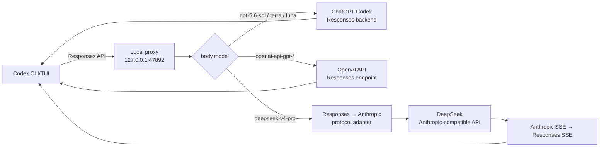

# Codex Local Multi-Upstream Proxy

Windows 上的 Codex CLI / VS Code 多上游路由代理。它在保留原生 Responses API、
工具调用和流式输出的同时，统一接入 ChatGPT 订阅账号池、OpenAI API、DeepSeek
和 OpenAI 兼容中转节点，并提供本地管理后台、稳定性保护与可观测性。

当前版本：**2.4.1**

## 主要能力

- ChatGPT 账号池按 5 小时/每周剩余额度选择账号，低额度账号自动避让。
- 同一 `session-id` / `thread-id` 默认粘住最后成功账号，兼顾上下文缓存和稳定性。
- 账号池支持优先级、轮询、额度、最少使用、延迟、可靠性、权重、随机和最后成功路径 9 种可选策略。
- 管理后台支持拖拽调整账号优先级，并可设置每账号路由权重和低额度阈值。
- 每个账号可独立设置安全余量、每日请求/Token 上限，并可按模型或会话专用预留。
- “紧急继续使用”必须确认额度耗尽风险并设置最长 24 小时的自动恢复时间。
- 账号池提供“条状简约型”和“卡片全面型”两种视图，浏览器会记住上次选择。
- 简约视图按固定列轨道纵向对齐账号、5 小时/每周额度、重置时间、性能、路由状态和快捷操作；未启用路由的账号使用灰色状态展示。
- 支持按账号或全池查询 Codex 额度重置次数，并在有可用次数时从账号卡片执行额度重置。
- 手动“同步额度/次数”及全池低频同步会在用量更新后查询同一账号的重置次数；任一端点
  失败时保留上次有效数据并明确显示是“用量”还是“重置次数”未同步。
- 额度重置会显著标注为高风险操作，要求输入完整账号名称、勾选目标账号和次数消耗确认项，并通过最终系统确认；服务端再次校验全部确认、账号 ID 和最新可用次数。
- 账号支持本地改名；新登录/导入账号会立即尝试同步额度，并明确显示同步中、失败或待重试状态。
- 新登录或手动导入的账号可设为“仅保存”，不会切换本机 Codex，也不会参与代理路由；需要时可单独启用。
- CPA/sub2 短期 Token 可批量预检并分类为可续约、兼容临时、24 小时内到期、已失效或
  OAuth 不兼容；兼容临时账号显示到期倒计时，到期自动停止路由。
- 导入账号支持“稳定保险池 / 日抛优先池”分级：可续约账号默认进入稳定池、临时账号
  默认进入日抛池；日抛账号优先消耗到 0，稳定账号只在日抛池不可用时按安全余量兜底。
- “能查询额度”不等于“能调用模型”：非 Codex 官方 OAuth 客户端签发的临时 Token
  会强制保持仅保存并提示官方登录，避免账号池持续产生 401。
- 合规稳定模式限制单账号并发为 3、忙碌请求进入本地等待队列、单请求最多尝试 2 个账号，并优先使用 30 分钟内的新鲜额度数据。
- 并发会根据成功、429、网络错误和高延迟在 1～3 之间自适应；请求槽位使用可续期租约，断连或异常退出后可自动回收。
- Token 刷新和额度刷新均使用单飞合并，区分临时网络错误与必须重新登录的永久凭据错误。
- 额度历史会生成到达安全余量的趋势预测，并支持模型级、账号级双层冷却。
- 提供优雅重启、全局单实例锁、安全配置回滚、账号独立备份/合并恢复、脱敏诊断报告和异常状态自动修复。
- 后台显示实际运行目录、入口、版本、Commit、启动时间和 PID，并对比工作区与安装副本；不一致时醒目提示。
- 支持一键备份部署：只复制运行清单内文件，随后重启并校验存活、运行路径、Commit 和文件一致性；失败自动恢复备份。
- 官方登录前预检全局 CLI、VS Code 内置 CLI、`app-server` OAuth 能力和私密浏览器，并可复制诊断与修复命令。
- 关闭官方登录弹窗会同步取消后台等待会话；重新进入时会清理遗留流程，文字框选产生的
  误点击不会再打开登录弹窗。
- 额度优先从真实模型响应头更新；后台仅刷新参与路由的账号，全池约 30 分钟、当前账号最低约 5 分钟，并带随机抖动与失败退避。
- 408、5xx 和网络错误由轻量 Provider Circuit Breaker 隔离，并支持半开自动恢复。
- 管理后台展示 Provider 熔断、恢复倒计时和最近账号路由决策，解释账号被选择或跳过的原因。
- Provider 的实际请求和手动检测结果会持久化，重启后台后仍显示最近状态、延迟、错误和检测时间。
- 上游重试遵循 `Retry-After` 并加入抖动；客户端断开会取消 ChatGPT、OpenAI、Relay 和 DeepSeek 请求。
- 响应附带 `X-Codex-Proxy-Request-Id`、Provider、Account、Model、Latency 和 Fallback 元数据。
- 管理后台健康矩阵展示每账号剩余额度、1h/24h/7d 成功率、请求数、429、最近状态以及 P50/P95/平均延迟。
- 自动诊断中心把 401、402、429、502、503 等错误与账号池实时分类合并，直接列出仅保存、登录失效、冷却、额度不足、每日上限、预留和并发占满数量。
- 账号池提供不发送模型请求的“检查所有账号”，逐号区分基础正常、额度不足、短时限流、
  登录失效、OAuth 不兼容、权限不足、暂时不可达及上游明确停用/封禁，并保留最近检查原因。
- 诊断结论提供“刷新额度”“重新登录”“等待冷却”“检测 Provider”等上下文操作。
- 账号和 Provider 健康支持 1h/24h/7d 切换，并统计熔断及账号切换次数，对近期成功率、429 或 P95 异常给出趋势预警。
- 控制台提供按月切换的 AI 使用日历，默认展示当前月份，并汇总今日请求、今日 Token 和连续活跃天数。
- 用量分析提供最近 30 天 Token 折线趋势、逐账号每日请求趋势及每日账号明细。
- 管理后台采用精密运维控制台视觉系统，支持明暗主题、工程网格背景、状态色指标和两列等高概览布局。
- 页面切换使用克制的分层进入动效，数据自动刷新不会重复播放；窄屏自动收敛为单列并支持减少动态效果偏好。
- 日志自动脱敏常见 Token/API Key/JWT，配置使用同目录原子写入。
- Windows 使用 DPAPI 保护本机 AES-256-GCM 密钥；配置和账号备份中的 Token/API Key 均以密文保存。
- 在 Codex 模型菜单中提供 `gpt-5.6-sol`、`gpt-5.6-terra`、`gpt-5.6-luna`、
  对应 `openai-api-*` API 版本，以及 `deepseek-v4-pro`。
- GPT 订阅请求使用 Codex 已有的 ChatGPT 登录态转发到 ChatGPT Responses 后端。
- GPT `*-API` 请求使用 `OPENAI_API_KEY` 转发到 OpenAI API。
- DeepSeek 请求在 OpenAI Responses 与 Anthropic Messages 协议之间双向转换。
- 支持文本、流式输出、function tools、custom tools、工具调用历史和 token usage。
- 修复历史裁剪造成的孤立 `tool_use`，并保证 `tool_result` 紧跟对应工具调用。
- 自动重试临时网络错误。
- 提供健康检查、请求日志、后台启动、Windows 登录自启动和运行期监控。
- 支持 DeepSeek、GPT 订阅、GPT API 三种显式启动模式。
- 默认不静默切换供应商；只有显式启用 `--auto-failover` 才自动回退。
- 请求级跨 Provider 回退默认关闭；可显式配置 ChatGPT → OpenAI API → Relay → DeepSeek，并按 HTTP 状态决定是否回退，401/402/403 永不盲目重试。
- 提供 `auto`、`auto-fast`、`auto-cheap`、`auto-reliable` 四个显式虚拟模型，分别侧重综合、延迟、成本和可靠性。
- 本地可更新模型价格目录，按请求/日/月估算成本；API 与中转线路可设置日/月预算，达到后回退免费订阅线路或停止请求。

## 工作原理



Codex 发往代理的 `body.model` 是实际路由依据。旧的线程路由文件仅保留用于诊断，
不会覆盖 Codex 原生模型选择。

### GPT 订阅路由

普通 GPT 模型（`gpt-5.6-sol`、`gpt-5.6-terra`、`gpt-5.6-luna`）保持 Responses API 格式。代理转发 Codex 提供的订阅鉴权、账户、线程和
客户端元数据，然后把上游流直接返回给 Codex。

代理首次会向 ChatGPT 上游保留
`X-OpenAI-Internal-Codex-Responses-Lite`。如果上游明确返回该模型不支持 Lite 的
`unsupported_value`，代理会自动取消 Lite 并重试一次，同时在当前进程内记住该
模型不支持 Lite。其他 400 错误不会触发降级。

### GPT API 路由

带 `-API` 后缀的模型通过 OpenAI API Key 调用，不使用 ChatGPT 订阅登录态。菜单显示名保持 `GPT-*-API`，内部 slug 使用 `openai-api-gpt-*`，避免 Codex 在 ChatGPT 登录态下把未知 `gpt-*` 名称提前拦截：

| 菜单显示 | 模型 slug | 上游 API model |
|---|---|---|
| `GPT-5.6 Sol (API Key)` | `openai-api-gpt-5.6-sol` | `gpt-5.6-sol` |
| `GPT-5.6 Terra (API Key)` | `openai-api-gpt-5.6-terra` | `gpt-5.6-terra` |
| `GPT-5.6 Luna (API Key)` | `openai-api-gpt-5.6-luna` | `gpt-5.6-luna` |

使用这些模型前需要设置 `OPENAI_API_KEY`。可选设置
`CODEX_OPENAI_API_BASE_URL`、`CODEX_OPENAI_API_RESPONSES_URL` 或
`CODEX_OPENAI_API_CHAT_COMPLETIONS_URL` 指向兼容端点。

### DeepSeek 路由

DeepSeek 路由执行以下转换：

1. 解析 Codex Responses 请求。
2. 把 instructions、messages、tools 和 tool choice 转成 Anthropic Messages。
3. 清理被截断历史中的孤立工具调用。
4. 调用 DeepSeek Anthropic 兼容接口。
5. 把普通响应或 SSE 流转换回 Responses API 事件。

## 系统要求

- Windows 10/11
- PowerShell 5.1 或更高版本
- Node.js 22.19 或更高版本（Gateway 管理前端使用 Vite 7）
- 已安装可用的全局 Codex CLI，或已安装包含原生 `codex.exe` 的 OpenAI Codex VS Code 扩展
- 使用 GPT 订阅模式时，已通过 Codex 完成 ChatGPT 登录
- 使用 GPT `*-API` 模型时，有有效的 `OPENAI_API_KEY`
- 使用 DeepSeek 时，有有效的 `DEEPSEEK_API_KEY`

## 安装

### 1. 克隆仓库

```powershell
git clone https://github.com/OscarYi9527/codex_proxy.git
cd codex_proxy
```

### 2. 预览安装操作

```powershell
powershell -NoProfile -ExecutionPolicy Bypass -File `
  .\install-codex-local-multi-proxy.ps1 -DryRun
```

### 3. 安装并启动

推荐让安装器持久化 DeepSeek Key、配置 Codex、安装登录自启动并立即启动代理：

```powershell
powershell -NoProfile -ExecutionPolicy Bypass -File `
  .\install-codex-local-multi-proxy.ps1 `
  -DeepSeekApiKey "你的 DeepSeek API Key" `
  -OpenAIApiKey "你的 OpenAI API Key（可选，用于 GPT-*-API）" `
  -StartProxy
```

如果还需要 VS Code Codex 扩展也能在模型菜单中选择 `deepseek-v4-pro`，可以一键安装 VS Code 兼容层并 patch 扩展前端模型过滤：

```powershell
powershell -NoProfile -ExecutionPolicy Bypass -File `
  .\install-codex-local-multi-proxy.ps1 `
  -DeepSeekApiKey "你的 DeepSeek API Key" `
  -StartProxy `
  -InstallVSCodeCompat `
  -PatchVSCodeWebview
```

> `-PatchVSCodeWebview` 会修改本机 VS Code OpenAI/Codex 扩展的 `model-list-filter-*.js`，升级扩展后可能需要重新执行安装器。

默认安装目录：

```text
%USERPROFILE%\.codex-local-multi-proxy
```

安装器会：

1. 复制运行文件到安装目录。
2. 在覆盖已有文件前创建时间戳备份。
3. 可选持久化 `DEEPSEEK_API_KEY` 和 `OPENAI_API_KEY` 到用户环境变量。
4. 备份并更新 `%USERPROFILE%\.codex\config.toml`。
5. 注册 `local_multi_proxy`，地址为 `http://localhost:47892/v1`。
6. 为 `local_multi_proxy` 写入 `requires_openai_auth = true`，确保官方 Codex 桌面应用仍能显示 ChatGPT 账号信息。
7. 安装 Windows 登录自启动 watchdog。
8. 在使用 `-StartProxy` 时立即启动代理。
9. 在使用 `-InstallVSCodeCompat` 时生成 VS Code launcher 并更新 `chatgpt.cliExecutable`。

不需要登录自启动：

```powershell
powershell -NoProfile -ExecutionPolicy Bypass -File `
  .\install-codex-local-multi-proxy.ps1 `
  -DeepSeekApiKey "你的 DeepSeek API Key" `
  -NoAutostart -StartProxy
```

### 安全部署更新

管理后台“系统设置”会同时展示当前运行副本、工作区和默认安装目录。当工作区存在尚未
部署的运行文件时，顶部会显示版本不一致警告，可点击“一键备份并部署更新”。也可以
在工作区手动执行：

```powershell
powershell -NoProfile -ExecutionPolicy Bypass -File `
  .\update-codex-proxy.ps1
```

脚本以 `runtime-files.json` 为唯一运行文件清单，部署前备份变化文件，使用原子替换写入，
然后请求优雅重启并检查 `/live` 与 `/admin/api/runtime-info`。运行路径、Commit、文件
一致性或健康检查任一失败都会恢复备份并重新启动旧版本。运行数据、账号配置、统计和
日志不在清单中，不会被覆盖。

仅预览变化或只复制、不重启：

```powershell
.\update-codex-proxy.ps1 -DryRun
.\update-codex-proxy.ps1 -NoRestart
```

自定义安装目录或端口：

```powershell
powershell -NoProfile -ExecutionPolicy Bypass -File `
  .\install-codex-local-multi-proxy.ps1 `
  -InstallDir "D:\Tools\codex-proxy" `
  -Port 47892 `
  -DeepSeekApiKey "你的 DeepSeek API Key" `
  -StartProxy
```

> 当前启动、停止和安全包装脚本默认使用端口 `47892`。如果修改安装端口，应同步
> 修改这些脚本或保持默认值。

### 4. 验证

```powershell
Invoke-RestMethod http://127.0.0.1:47892/live
Invoke-RestMethod http://127.0.0.1:47892/ready
Invoke-RestMethod http://127.0.0.1:47892/v1/models
```

健康响应示例：

```json
{
  "status": "ok",
  "provider": "deepseek",
  "port": 47892
}
```

## 使用

### 使用本地多上游代理

```powershell
powershell -ExecutionPolicy Bypass -File `
  "$HOME\.codex-local-multi-proxy\codex-mode.ps1" deepseek
```

虽然模式名是 `deepseek`，该模式加载的是混合模型目录，因此可以在 Codex 内部通过
模型菜单切换 GPT 与 DeepSeek。

### 直接使用 GPT 订阅

```powershell
powershell -ExecutionPolicy Bypass -File `
  "$HOME\.codex-local-multi-proxy\codex-mode.ps1" gpt-subscription
```

该模式复用默认 `%USERPROFILE%\.codex` 的 ChatGPT 登录态，并显式覆盖可能残留的
本地代理 provider。

### 使用独立 GPT API 配置

```powershell
powershell -ExecutionPolicy Bypass -File `
  "$HOME\.codex-local-multi-proxy\codex-mode.ps1" gpt-api
```

该模式使用 `%USERPROFILE%\.codex-modes\gpt-api`，避免 API 登录与 ChatGPT
订阅登录互相覆盖。

### 自动故障转移

#### Codex 子进程级回退

默认情况下代理离线会终止当前 DeepSeek Codex 子进程，不会偷偷改变供应商。
如确实需要自动切到 GPT 订阅：

```powershell
powershell -ExecutionPolicy Bypass -File `
  "$HOME\.codex-local-multi-proxy\codex-safe.ps1" `
  --route deepseek --auto-failover
```

#### 请求级显式跨 Provider 回退

请求级回退同样默认关闭。可在“系统设置 → 智能路由与显式回退”勾选开启，并按行配置：

```text
chatgpt-sub | gpt-5.6-sol
openai-api | openai-api-gpt-5.6-sol
relay:hk-01 | relay-hk-01-gpt-5.4
deepseek | deepseek-v4-pro
```

只有配置的状态（默认 `429, 502, 503, 504`）才进入下一 Provider。`400`、`401`、
`402`、`403`、`404`、`409`、`422` 以及鉴权、计费、权限、参数错误始终直接返回，
避免跨供应商盲目重试。普通模型仍遵循默认关闭；用户主动选择以下虚拟模型即表示
明确允许智能跨 Provider：

| 虚拟模型 | 策略 |
|---|---|
| `auto` | 综合成功率、额度、Provider 状态和延迟 |
| `auto-fast` | 优先 24h P95 延迟 |
| `auto-cheap` | 优先本地价格目录中的低成本，免费订阅优先 |
| `auto-reliable` | 优先成功率、账号剩余额度和健康状态 |

流式成功响应仍直接转发，不会为了回退而缓存完整输出；只有错误响应会在本地短暂缓冲，
确认符合回退规则后才尝试下一 Provider。

## 服务管理

手动启动：

```powershell
powershell -ExecutionPolicy Bypass -File `
  "$HOME\.codex-local-multi-proxy\start-codex-proxy.ps1"
```

停止：

```powershell
powershell -ExecutionPolicy Bypass -File `
  "$HOME\.codex-local-multi-proxy\stop-codex-proxy.ps1"
```

安装或卸载自启动：

```powershell
powershell -ExecutionPolicy Bypass -File `
  "$HOME\.codex-local-multi-proxy\install-codex-proxy-autostart.ps1"

powershell -ExecutionPolicy Bypass -File `
  "$HOME\.codex-local-multi-proxy\uninstall-codex-proxy-autostart.ps1"
```

## AI Editor Gateway / Edge 开发基线

当前分支同时保留第一轮合同 Mock，并已加入 T023–T033 真实产品认证与安全本机绑定、
T038–T046 真实模型目录和 Responses/Chat Completions 转发。该分支堆叠依赖
`feature/custom-api-urls@e3ed1d6`，不能先于依赖分支单独合并。接口事实来源固定为：

```text
My_Code@dca68160b25cee78b2c231c4fbd8398624ab93ff/
  specs/002-ai-editor-account-gateway/contracts/
```

```powershell
# 安装 workspace 依赖并启动 Gateway + Edge
npm install
powershell -NoProfile -ExecutionPolicy Bypass -File `
  .\tools\start-ai-editor-dev.ps1 -Mode all

# 停止；只会处理当前仓库写入隔离数据根的 PID
powershell -NoProfile -ExecutionPolicy Bypass -File `
  .\tools\stop-ai-editor-dev.ps1 -Mode all
```

固定开发地址：

```text
Gateway：http://127.0.0.1:47920
Edge：   http://127.0.0.1:47921
数据根： .ai-editor-dev/default/
```

未显式指定认证模式时，启动器默认使用 `real`。空数据库首次启动会在前台只显示一次
固定登录名 `admin` 和高熵临时密码；完成系统浏览器 PKCE 登录后，必须立即修改密码并
填写邮箱，之后才能访问 `/v1/models` 或发送 Turn。Access Token 仅有效 5 分钟，Edge
只在内存保存 Access Token，并通过 Windows DPAPI CurrentUser 或 macOS Keychain 保存
滚动 30 天的 Refresh Token。授权码、Refresh Token 和邀请码在 Gateway 数据库中只保存
keyed digest；检测到 Refresh Token 重放时会撤销整个 Token family 和当前设备会话。

真实模式的模型目录只返回隔离 Gateway 当前已配置且可用的 Provider 模型；`gpt-mock`
会被明确过滤，不能作为真实 AI 链路验收证据。Gateway 通过兼容适配器复用现有 Provider、
路由和流式协议模块，但配置、账号、统计、线程路由和健康数据全部写入当前
`.ai-editor-dev/.../gateway/`，不会读取或复制共享 `47892` 的数据。Edge 会为每个 Turn
附加五分钟 Access Token、设备会话和稳定 Turn ID，并在账号切换时保持已在途请求的旧
身份快照。

需要继续运行 Oscar 第一轮 Mock 脚本时，显式使用：

```powershell
powershell -NoProfile -ExecutionPolicy Bypass -File `
  .\tools\start-ai-editor-dev.ps1 -Mode all `
  -AuthenticationMode mock -MockState ready
```

Gateway Mock Bearer Token 为 `mock-access-token`、`mock-level2-token` 和
`mock-level1-token`。Edge 本机 nonce 每次启动随机生成在隔离数据根的
`edge-local-nonce.secret`，请求 `/ai-editor/*` 时通过 `X-AI-Editor-Local-Nonce`
发送；nonce、ticket 和 handoff 凭据不得提交或写入日志。开发脚本会拒绝共享端口
`47892`、公开监听地址和仓库根数据目录。启动命令只有在两个服务的 `/live` 均返回
预期模式后才成功；任一服务启动失败时会按相反顺序停止本次已启动的进程。

Mock 覆盖：

- Gateway：账号状态/重试、Webview ticket、退出和模型列表。
- Edge：状态/重试、一次性 handoff、防重放、Webview ticket、退出和模型列表。
- 状态：`ready`、`login_required`、`account_unavailable`、
  `service_unavailable`、`password_change_required`。

Mock 启动时可用 `-MockState service_unavailable` 指定初始状态。开发环境还可以携带本机
nonce 调用 `POST /ai-editor/mock/state` 动态切换状态；该接口仅在开发脚本显式设置
`AI_EDITOR_ENABLE_MOCK_CONTROL=true` 时存在。重置数据必须同时给出规范化后的同一路径：

```powershell
$root = [IO.Path]::GetFullPath(".ai-editor-dev\default")
powershell -NoProfile -ExecutionPolicy Bypass -File `
  .\tools\reset-ai-editor-dev.ps1 `
  -DataRoot $root -ConfirmDataRoot $root -Force
```

真实模式同时提供 `/admin` 专用管理外壳。Code 注入的一次性 Webview ticket 只保存
keyed digest、60 秒后过期且只能消费一次；交换成功后仅设置 30 分钟
`HttpOnly; SameSite=Strict` 管理 Cookie。管理页面校验同窗口、同源、固定 envelope
版本和固定 route，不把 ticket 或 Token 写入 URL、React state、Web Storage 或日志。
普通用户可查看自己的账号、积分、设备和使用记录；导航模型由 Gateway 按角色返回，
不能依赖前端隐藏菜单授权。开发启动器会在真实模式启动前构建该 React 页面。

一级管理员还可以在同一管理外壳中配置 ChatGPT、OpenAI API、DeepSeek 和 Relay
Provider，查看动态模型路由与脱敏诊断。`/api/v1/admin/providers*`、
`/api/v1/admin/models*` 和 `/api/v1/admin/diagnostics*` 会在服务端重新校验数据库中的
一级管理员角色；普通用户和二级管理员均返回 `403`，不会收到凭据、路由、熔断或底层
诊断。凭据响应只包含掩码、存储格式和时间字段。

一级和二级管理员还会看到“调用审计”。Gateway 只保存脱敏用户问题、最终 AI 回复、
公共模型、时间和 Token，不保存系统提示、文件、推理或工具输出。二级管理员只能查询
本组织；一级管理员可筛选全部组织并设置 7–180 天正文保留期。正文到期后列表会明确
显示“正文已清理”，但 Token 和用量聚合仍保留。读取正文的允许、拒绝和失败结果本身
也会写入不含正文的管理员审计。

当前 MVP 的 `plaintext-v1` 仅允许回环 development/test。页面持续显示安全警告；只要
数据库中存在这种凭据，Gateway 就拒绝在 production 或非回环地址启动。OpenAI 官方
登录通过隔离 `CODEX_HOME` 启动 `codex app-server`，只向页面返回登录 URL 和安全状态，
完成后把 `auth.json` 导入 Gateway 数据库并删除临时目录，不读取或改写共享
standalone 的账号文件。正式部署前仍须完成计划中的 envelope-v1 信封加密迁移。

Gateway 默认使用 SQLite（WAL、外键和 5 秒 busy timeout）；production 强制使用
PostgreSQL。设置 `AI_EDITOR_GATEWAY_DB_DIALECT=postgres`、
`AI_EDITOR_GATEWAY_POSTGRES_URL` 和
`AI_EDITOR_GATEWAY_POSTGRES_TLS_CA`。需要客户端 mTLS 时同时设置
`AI_EDITOR_GATEWAY_POSTGRES_TLS_CERT` 与
`AI_EDITOR_GATEWAY_POSTGRES_TLS_KEY`；数据库证书名称不同于连接 URL host 时可设置
`AI_EDITOR_GATEWAY_POSTGRES_TLS_SERVER_NAME`。TLS 始终
`rejectUnauthorized=true`，连接串中的全部 `ssl*` 参数会被拒绝，防止覆盖显式 CA
验证。

production Gateway 不会用运行时数据库身份自动执行迁移，也不允许
`AI_EDITOR_GATEWAY_MIGRATE_ON_START=true`。部署者应使用独立、临时授权的 migration
身份运行 `npm run gateway:bootstrap`，完成迁移/首次管理员初始化后，再用只具有业务
DML 权限的 Gateway 运行时身份启动服务。生产启动会查询 PostgreSQL 当前角色，并拒绝
superuser、建角色、建库、复制、绕过 RLS、数据库 CREATE/TEMP、schema CREATE、
应用对象所有者和服务器文件/程序执行权限。两个方言仍通过同一个 `inTransaction`
边界执行原子业务操作。正式发布仍须完成选定云 PostgreSQL 的真实
TLS/权限/回滚演练以及 T136b 其余 KMS、异机备份和恢复门禁。

## HTTP 接口

| 方法 | 路径 | 用途 |
|---|---|---|
| `GET` | `/live` | 进程存活检查 |
| `GET` | `/ready` | 至少一个上游可用的就绪检查 |
| `GET` | `/health` | 向后兼容的就绪检查 |
| `HEAD` | `/v1` | provider 连通性检查 |
| `GET` | `/v1/models` | Codex/OpenAI 兼容模型目录 |
| `POST` | `/v1/responses` | 主 Responses API |
| `GET` | `/v1/responses/:id` | Responses 查询兼容接口 |
| `POST` | `/v1/chat/completions` | Chat Completions 兼容入口 |
| `PUT/GET/DELETE` | `/control/threads/:id/route` | 旧线程路由诊断接口 |
| `GET` | `/admin` | 管理后台 Web 界面 |
| `GET` | `/admin/api/config` | 获取当前配置（密钥掩码） |
| `PUT` | `/admin/api/config` | 保存配置并热重载 |
| `GET` | `/admin/api/stats` | 获取 Provider、模型和账号健康统计 |
| `GET` | `/admin/api/diagnostics` | 获取不含 Token/邮箱的本地诊断报告 |
| `GET` | `/admin/api/diagnosis` | 获取实时自动诊断；可传 status、type、provider、model |
| `GET/PUT` | `/admin/api/prices` | 查询或更新本地模型价格目录 |
| `GET` | `/admin/api/costs` | 获取请求、今日、月度累计成本和预算状态 |
| `GET` | `/admin/api/error-guide` | 获取 HTTP 错误码原因与处理建议查找表 |
| `GET` | `/admin/api/runtime-info` | 获取实际运行版本、路径及部署一致性 |
| `POST` | `/admin/api/deploy-update` | 从本机启动备份、部署、重启、健康检查和自动回滚 |
| `GET` | `/admin/api/chatgpt-login/preflight` | 检查 Codex CLI、app-server OAuth 和私密浏览器 |
| `POST` | `/admin/api/chatgpt-accounts/import` | 本机批量解析账号文件，分类临时/可续约凭据并校验 OAuth 兼容性 |
| `POST` | `/admin/api/chatgpt-accounts/refresh-usage-all` | 同步全池账号用量及对应重置次数 |
| `POST` | `/admin/api/chatgpt-accounts/check-all` | 非消耗式检查全部账号并返回逐号故障分类 |
| `GET` | `/admin/api/config-snapshots` | 列出最近配置快照 |
| `POST` | `/admin/api/chatgpt-accounts/:id/reset-credits` | 查询指定账号的 Codex 重置次数 |
| `POST` | `/admin/api/chatgpt-accounts/refresh-reset-credits-all` | 查询账号池全部账号的重置次数 |
| `POST` | `/admin/api/chatgpt-accounts/:id/reset-quota` | 完成三重确认后消耗一次机会并重置额度 |
| `POST` | `/admin/api/config-rollback` | 回滚所选配置快照 |
| `POST` | `/admin/api/runtime-repair` | 清理异常冷却与过期租约 |
| `POST` | `/admin/api/proxy/restart` | 优雅重启代理 |

控制接口只应通过 localhost 使用，不要把代理监听地址暴露到公网。

## 配置

主要环境变量：

| 变量 | 默认值 | 说明 |
|---|---|---|
| `DEEPSEEK_API_KEY` | 无 | DeepSeek 鉴权，使用 DeepSeek 时必需 |
| `OPENAI_API_KEY` | 无 | GPT `*-API` 模型鉴权 |
| `OPENAI_ORG_ID` | 无 | 可选 OpenAI Organization header |
| `OPENAI_PROJECT_ID` | 无 | 可选 OpenAI Project header |
| `DEEPSEEK_ANTHROPIC_URL` | DeepSeek 官方 Anthropic 兼容地址 | DeepSeek 上游 |
| `CODEX_CHATGPT_RESPONSES_URL` | ChatGPT Codex Responses 地址 | GPT 订阅上游 |
| `CODEX_OPENAI_API_BASE_URL` | `https://api.openai.com/v1` | GPT API 上游 base URL |
| `CODEX_OPENAI_API_RESPONSES_URL` | `${CODEX_OPENAI_API_BASE_URL}/responses` | GPT API Responses 上游 |
| `CODEX_OPENAI_API_CHAT_COMPLETIONS_URL` | `${CODEX_OPENAI_API_BASE_URL}/chat/completions` | GPT API Chat Completions 上游 |
| `CODEX_PROXY_HOST` | `127.0.0.1` | 本地监听地址 |
| `CODEX_PROXY_PORT` | `47892` | 本地监听端口 |
| `CODEX_PROXY_MAX_BODY_MIB` | `64` | 请求体上限（MiB），最高限制为 256 |
| `CODEX_PROXY_BODY_TIMEOUT_MS` | `60000` | 不完整上传超时，最高限制为 300000 毫秒 |
| `CODEX_PROXY_DEFAULT_MODEL` | `gpt-5.6-sol` | 请求未指定模型时的默认值（GPT-5.6 Sol 订阅版） |
| `CODEX_SAFE_AUTO_FAILOVER` | `0` | 设为 `1` 启用自动 GPT 回退 |
| `CODEX_ROUTE` | `deepseek` | `codex-safe.ps1` 默认启动路由 |


### 配置文件方式（无需修改环境变量）

将 codex-proxy-config.json 放在代理安装目录下，即可覆盖默认 API 地址，无需修改系统环境变量。

优先级：**环境变量 > 配置文件 > 内置默认值**


### 管理后台 Web 界面

代理启动后访问 http://127.0.0.1:47892/admin 打开管理后台。

功能：
- 可视化编辑 API 地址、密钥、默认模型和中转节点
- ChatGPT 官方隔离登录（全局 CLI 损坏时自动回退到 VS Code 内置 Codex）、账号仅保存/启用、拖拽优先级和 9 种路由策略
- ChatGPT 账号文件快捷导入：支持标准 `auth.json`、sub2 JSON、CPA JSON 和包含
  `access_token`、`account_id` 的 TXT；多文件导入前逐文件预览凭据类型、剩余有效期、
  重复账号和 OAuth 客户端兼容性
- 完整 `refresh_token` 账号归类为“可续约”；缺少 Refresh Token 但由 Codex 官方
  OAuth 客户端签发的账号归类为“临时”，显示倒计时并在到期后自动停止路由
- 非 Codex OAuth Token 即使能够查询 `/backend-api/wham/usage`，也会归入“不兼容”
  分类并强制仅保存；可通过批量官方登录将原临时记录原地升级为可续约账号
- 账号改名、首次额度自动同步、独立账号备份以及只补回缺失账号的安全恢复
- 每账号安全余量、每日请求/Token 上限、模型/会话预留，以及带风险确认和自动到期的紧急继续
- 5 小时/每周额度、趋势预测、1h/24h/7d 成功率、P50/P95 延迟和双层冷却
- 账号池简约/全面双视图、固定列对齐、额度重置时间和灰色停用状态
- Codex 重置次数单账号/全池查询，以及带风险勾选、账号名称和账号 ID 多重校验的额度重置
- 月度 AI 使用日历、今日指标、30 天双栏趋势图和逐账号每日 Token/成功/失败明细
- AI 日历与最近调用、服务状态与运行信息采用两列等高网格，桌面端上下边界对齐
- 精密运维控制台主题、明暗模式、键盘焦点状态、减少动态效果支持和移动端单列布局
- 自适应并发、等待队列、请求租约、设置级安全回滚和优雅重启
- 最近路由决策、Provider 熔断状态、恢复倒计时和手动重置
- DPAPI + AES-256-GCM 凭据保护状态
- 实际运行版本/Commit/路径与工作区安装一致性，以及安全一键部署
- 官方登录前 CLI、`app-server` OAuth 与浏览器预检，可复制完整诊断和修复命令
- 零基础使用教程，以及一键生成不含凭据和邮箱的诊断报告

用量统计 API：
| 方法 | 路径 | 说明 |
|---|---|---|
| `GET` | `/admin/api/stats` | 获取所有用量统计 |
| `DELETE` | `/admin/api/stats` | 重置用量统计 |

统计维度：
- 按 provider 分组：`chatgpt`、`openai-api`、`deepseek`
- 每 provider 包含：请求数、输入/输出 token 数
- 每 provider 按 model 细分统计
- 按自然日记录完成请求、账号路由尝试、输入/输出 Token，并细分到 provider 和 ChatGPT 账号
- 每日统计保留约 370 天，用于生成使用日历、30 天趋势和逐账号明细
- 每日历史从升级到支持该功能的版本后开始积累，不会根据已有累计数据反向推算
- 所有统计均保存在本机，不会上传到第三方
- 数据自动每 30 秒持久化到 `codex-proxy-stats.json`

用量数据保护：
- 常规源码更新、前端部署、配置保存和优雅重启不会清空累计用量。
- 部署时不要复制、覆盖或删除运行目录中的 `codex-proxy-stats.json`。
- 只有管理后台明确确认“清空统计”或直接调用 `DELETE /admin/api/stats` 才会重置本地累计统计。
- “今日用量”按 `Asia/Shanghai` 自然日统计，会在北京时间 00:00 切换到新一天；这不影响累计统计。
- ChatGPT 账号剩余额度来自官方最新响应，实际请求或手动刷新后可能下降，这与本地统计重置无关。

API 端点：
| 方法 | 路径 | 说明 |
|---|---|---|
| GET | /admin | 管理后台 HTML 页面 |
| GET | /admin/api/config | 获取当前配置（密钥已掩码） |
| PUT | /admin/api/config | 保存配置到文件并热重载 |
| GET | /admin/api/diagnostics | 获取队列、账号、熔断和凭据保护状态 |
| GET | /admin/api/diagnosis | 获取实时问题结论、账号分类、趋势和一键动作描述 |
| GET/PUT | /admin/api/prices | 查询或更新每百万 Token 本地估算价格 |
| GET | /admin/api/costs | 获取 Provider 日/月/累计成本和预算门禁状态 |
| GET | /admin/api/error-guide | 获取 HTTP 错误码原因与处理建议查找表 |
| GET | /admin/api/runtime-info | 获取实际运行位置、版本、Commit 和安装一致性 |
| POST | /admin/api/deploy-update | 启动安全部署、重启、健康检查和失败回滚 |
| GET | /admin/api/chatgpt-login/preflight | 获取官方登录环境预检结果 |
| POST | /admin/api/chatgpt-accounts/import | 本机解析并批量导入 auth.json、sub2/CPA JSON 或凭据 TXT，并返回临时/可续约/不兼容统计 |
| POST | /admin/api/chatgpt-accounts/refresh-usage-all | 同步全部账号的用量和重置次数 |
| POST | /admin/api/chatgpt-accounts/check-all | 检查全部账号的凭据、用量和重置次数并返回故障分类 |
| GET | /admin/api/config-snapshots | 获取设置快照列表 |
| POST | /admin/api/config-rollback | 仅回滚设置，不回退账号 Token/API Key |
| GET | /admin/api/account-backups | 获取账号备份列表 |
| POST | /admin/api/account-backups/restore | 合并恢复缺失账号，不覆盖现有凭据 |
| POST | /admin/api/chatgpt-accounts/:id/reset-credits | 查询指定账号的 Codex 重置次数 |
| POST | /admin/api/chatgpt-accounts/refresh-reset-credits-all | 查询全部账号的 Codex 重置次数 |
| POST | /admin/api/chatgpt-accounts/:id/reset-quota | 经三重确认后重置指定账号额度 |
| GET | /admin/api/resilience | 获取 Provider 熔断状态 |
| DELETE | /admin/api/resilience | 重置 Provider 熔断状态 |

#### Codex 额度重置

重置次数接口属于 ChatGPT Codex 订阅后端能力，不是公开 OpenAI API；不同套餐或账号
可能返回不可用。管理后台只持久化可用次数、总次数、到期时间和查询时间，不会把
一次性的 `redeem_request_id` 返回前端或写入公开配置。

账号用量与重置次数是两个独立的上游端点。后台“同步额度/次数”会顺序查询两者，所以在
其他设备消耗重置机会后，执行一次同步即可同时更新额度和剩余次数；如果次数端点暂时失败，
旧次数不会被伪造为最新值，卡片会显示查询错误和上次查询时间。

执行重置时必须完成以下保护：

1. 先查询并确认账号存在可用重置次数。
2. 输入完整账号名称。
3. 勾选“确认目标账号”和“消耗 1 次且不可撤销”两个风险确认项。
4. 在最终系统提示中再次确认；提交期间不要关闭弹窗或重复点击。
5. 服务端校验所有确认项、账号名称和上游账号 ID。
6. 提交前重新查询最新次数，再消耗最早到期的有效机会。

管理接口请求体必须显式携带全部确认信息：

```json
{
  "confirmed": true,
  "confirmedTargetAccount": true,
  "confirmedCreditConsumption": true,
  "confirmedAccountId": "上游账号 ID",
  "confirmedAccountLabel": "完整账号名称"
}
```

额度重置会消耗一次机会且无法撤销。管理接口仅应通过 localhost 使用。

#### CPA / sub2 临时账号兼容性

CPA 和 sub2 是文件结构，不代表其中 Token 一定具有 Codex 订阅推理权限。导入器会同时
检查 Access Token 的到期时间和 OAuth `client_id`：

- `client_id = app_EMoamEEZ73f0CkXaXp7hrann`：Codex 官方 OAuth 客户端；没有
  `refresh_token` 时可以作为临时账号使用到 Access Token 到期。
- 其他 OAuth 客户端：账号可以保存，部分 Token 也可能成功查询额度，但不能据此认定
  能调用 `https://chatgpt.com/backend-api/codex/responses`；系统会标记“不兼容”、关闭路由
  并拒绝手动重新启用。
- 只有邮箱、密码、邮箱 OAuth client/refresh token 的 TXT：不能直接调用 ChatGPT，
  只能辅助在隔离浏览器中完成官方登录。

快捷导入界面会逐文件显示“可自动续约”“临时直导”“不可用于订阅通道”或“不能直导”。
账号池可按“可续约 / 临时 / 24h 内到期 / 已失效 / 不兼容”筛选。需要把临时或不兼容
记录转为长期可用账号时，使用“批量登录队列”；官方 OAuth 成功后会保留原账号池记录
并写入可轮换 Refresh Token。批量文件中单个临时 Token 已过期时只拒绝该账号，不会
阻止同一批次中的其他有效账号导入；结果会分别返回新增、重复、无效和不兼容数量。

如果出现“额度接口 200、模型请求 401”，说明 Token 只通过了账号信息接口鉴权，不具备
订阅 Responses 权限。本地代理无法为上游 Token 增加 scope；必须完成 OpenAI 官方登录，
或重新取得由 Codex 官方 OAuth 客户端签发的凭据。

#### 稳定保险池与日抛优先池

快捷导入、单账号官方登录、批量官方登录和账号“额度策略”均可设置账号池分级。分类会在
OAuth 登录完成、账号凭据落库时一并保存，后续无需再次整理：

- **自动分级**：文件导入未指定分类时，带 ChatGPT Refresh Token 的可续约账号进入
  稳定保险池；只有兼容 Access Token 的临时账号进入日抛优先池。
- **登录时指定**：单账号官方登录默认稳定保险池；面向 CPA/sub2 的批量官方登录默认
  日抛优先池。开始登录前可明确调整，登录成功提示会同时显示最终写入的分类。
- **稳定保险池**：保留全局或账号独立的安全余量。只要存在可调度的日抛账号，新请求
  就不会使用稳定池；日抛池耗尽、冷却、忙碌或失效后才由稳定池兜底。
- **日抛优先池**：安全余量固定为 0，优先于稳定池使用。已知额度到达 0 后停止调度并
  开始等待额度恢复；额度恢复时自动取消弃号倒计时。
- **7 天弃号**：以周额度窗口为优先判断依据。日抛账号从周额度归零起连续 7 天仍未恢复，
  系统会把账号标记为“已弃号”并关闭路由。为避免误删，凭据和历史记录仍保留，可在后台
  核对或手动移除；若要恢复，先将账号改为稳定保险池，再重新启用路由。

账号池页面支持“稳定池 / 日抛池 / 已弃号”筛选，并显示等待重置与弃号倒计时。OAuth
不兼容、Token 已过期等凭据错误仍优先于分级策略，不能通过选择日抛池绕过鉴权检查。

#### 全账号状态检查

“检查所有账号”会以最多 2 个并行任务逐号同步凭据、用量和重置次数，不发送模型请求，
也不会因此消耗模型额度。结果会写入账号卡片，并可通过“检查异常”筛选查看：

- 只有上游错误明确包含账号已停用、暂停或封禁时，才标记“疑似封禁或停用”。
- `401`、Refresh Token 永久失效和临时 Token 到期分别归类为登录失效或令牌到期。
- `402`、`insufficient_quota`、用量窗口为 0 和普通 `429` 分别区分额度不足与短时限流。
- 网络错误、超时和 `5xx` 标记为“暂时无法连接”，不会误判成封号。
- 普通 `403` 标记为权限不足；需核对套餐、地区和服务权限。

该检查只验证非消耗式账号端点。“基础检查正常”说明凭据和额度查询可用，不承诺每个模型
都具备权限；实际模型路由返回的 `401/403/429` 仍会覆盖为更具体的最近状态。

#### 每账号额度治理

账号卡片“额度策略”可设置 `low_quota_threshold`、`daily_request_limit`、
`daily_token_limit`、`reserved_models` 和 `reserved_session_ids`。达到任一每日上限后，
该账号会停止接收新请求；每日统计按北京时间自然日恢复。设置预留后，普通请求不会
占用该账号，匹配模型或 `session-id` / `thread-id` 的请求会优先使用它。

紧急继续会暂时绕过安全余量与每日上限，必须勾选风险确认并通过最终系统确认；最长
24 小时，`emergency_continue_until` 到期后无需重启即自动恢复原保护。该功能不会增加
官方额度，剩余 10% 仍可能被快速耗尽。

#### 成本与预算

`model-prices.json` 是可更新的本地估算目录，单位为 USD / 1,000,000 Tokens。管理后台
可修改价格并显示每个 Provider 的请求累计、今日与本月估算。价格不会读取或修改真实
账单，初始估算值仅用于本地治理，使用前应按服务商最新价格核对。

`provider_budgets` 支持为 `openai-api`、`deepseek`、`relay:<id>` 或 `relay:*` 设置：

```json
{
  "openai-api": { "daily_usd": 2, "monthly_usd": 30, "action": "fallback" },
  "relay:*": { "daily_usd": 1, "monthly_usd": 15, "action": "stop" }
}
```

`fallback` 会在显式回退计划或 `auto*` 计划中跳过超预算线路；没有后续线路时仍返回
可诊断的 `402 budget_exceeded`。`stop` 会立即停止请求，不调用上游。

配置文件支持以下字段（均可通过管理后台修改）：
| 字段 | 说明 |
|---|---|
| chatgpt_responses_url | ChatGPT 订阅鉴权转发地址 |
| upstream_url | DeepSeek Anthropic 兼容 API 地址 |
| deepseek_api_key | DeepSeek API 密钥 |
| openai_api_base_url | OpenAI API Base URL |
| openai_api_key | OpenAI API 密钥 |
| openai_org_id | OpenAI Organization ID（可选） |
| openai_project_id | OpenAI Project ID（可选） |
| openai_api_responses_url | OpenAI Responses 地址（可选） |
| openai_api_chat_completions_url | OpenAI Chat Completions 地址（可选） |
| default_model | 默认模型 |
| cross_provider_fallback_enabled | 是否显式开启请求级跨 Provider 回退 |
| fallback_chain | Provider 与具体模型组成的有序回退链 |
| fallback_statuses | 允许进入下一 Provider 的 HTTP 状态 |
| provider_budgets | Provider 日/月 USD 预算及 fallback/stop 动作 |


```json
{
  "chatgpt_responses_url": "https://your-custom-chatgpt.com/backend-api/codex/responses",
  "upstream_url": "https://your-custom-deepseek.com/anthropic/v1/messages",
  "openai_api_base_url": "https://your-custom-openai.com/v1"
}
```


模型能力位于 `codex-models.json`。Codex provider 配置示例：

```toml
model = "gpt-5.6-sol"
model_provider = "local_multi_proxy"
model_catalog_json = "C:\\Users\\you\\.codex-local-multi-proxy\\codex-models.json"

[model_providers.local_multi_proxy]
name = "Local Multi-Upstream Proxy"
base_url = "http://localhost:47892/v1"
wire_api = "responses"
requires_openai_auth = true
```

`requires_openai_auth = true` 很重要：Codex 桌面应用的账号/Profile UI 会通过 app-server 的 `account/read` 判断是否有 ChatGPT 账号。如果自定义 provider 没有声明需要 OpenAI auth，官方应用可能返回 `account: null`，导致 GPT 仍可用但右上角账号信息不显示。

## 日志和诊断

安装目录中的主要运行文件：

| 文件 | 内容 |
|---|---|
| `codex-proxy.log` | 服务标准输出 |
| `codex-proxy.error.log` | 服务错误输出 |
| `%USERPROFILE%\.claude\proxy\codex-proxy-requests.log` | 已脱敏请求日志（自动轮转） |
| `.codex-proxy.pid` | 当前代理 PID |
| `codex-proxy-watchdog.log` | watchdog 恢复记录 |
| `.credential-key.dpapi.json` | 由当前 Windows 用户 DPAPI 保护的本机数据密钥 |
| `.account-backups\` | 已加密的账号池备份，删除/恢复前自动创建 |
| `.release-manifest.json` | 安装版本、Commit、来源和运行文件 SHA-256 清单 |
| `.last-deployment.json` | 最近一次部署成功或自动回滚结果 |
| `.deploy-backups\` | 安全部署覆盖前的按时间戳文件备份 |

常用诊断命令：

```powershell
Get-Content "$HOME\.claude\proxy\codex-proxy-requests.log" -Tail 50
Get-Content "$HOME\.codex-local-multi-proxy\codex-proxy.error.log" -Tail 50
Get-Process -Id (Get-Content "$HOME\.codex-local-multi-proxy\.codex-proxy.pid")
Invoke-RestMethod http://127.0.0.1:47892/admin/api/runtime-info
Invoke-RestMethod http://127.0.0.1:47892/admin/api/chatgpt-login/preflight
```

## 测试

```powershell
npm test
npm run gateway:test
npm run admin:test
npm run test:dev-scripts
npm run test:provider-worker
npm run check
npm run gateway:build
npm run admin:build
npm run provider-worker:release-check
npm run provider-worker:build-release
npm run release:check
git diff --check
```

自动化测试使用本地 mock，不会消耗真实模型额度。

`npm run release:check` 会核对 package/lock/README/CHANGELOG 版本、运行文件清单、
JavaScript 与 PowerShell 语法，并执行 standalone/Edge、Gateway、React、隔离脚本测试、
TypeScript 检查、生产构建和空白错误检查。旧配置或统计首次加载时会自动补齐当前
schema；仅在确有变化时写回，并先把原始文件保存到 `.migration-backups/`。

## 常见问题

### OpenAI 官方安全登录提示 `Node.js v...`

这不是 Node.js 版本不兼容，而是全局 npm 安装的 Codex CLI 启动失败时，旧界面只截取了
错误输出的最后一行。常见真实原因是缺少 `@openai/codex-win32-x64` 等平台运行包。

当前版本会先验证每个 Codex 启动入口；全局 npm CLI 损坏时，自动回退到 OpenAI Codex
VS Code 扩展内置的原生 `codex.exe`，并在登录状态中显示实际使用的来源和版本。若本机
没有可用的回退版本，请重新安装全局 CLI：

```powershell
npm uninstall -g @openai/codex
npm install -g @openai/codex@latest
codex --version
```

### HTTP 报错代码查找表

管理后台左侧“新手使用教程”提供可搜索的完整查找表。状态码只是问题分类，还需要结合
完整报错正文、Provider 和 `X-Codex-Proxy-Request-Id` 判断来源。同一个 503 既可能
是本地账号池不可用，也可能是上游维护。

| 状态码 | 通常表示 | 优先检查 |
|---|---|---|
| 400 | 请求参数或格式错误 | 报错指出的字段、模型名、接口兼容性 |
| 401 | 密钥或登录凭据无效 | API Key、账号池“登录失效”状态 |
| 402 | 余额、计费或套餐权益不可用 | 对应 Provider 的余额、账单和模型权限；ChatGPT 订阅不等于 API 余额 |
| 403 | 已认证但权限不足 | 模型/项目权限、Organization、地区或本机管理权限 |
| 404 | 路径、模型或资源不存在 | Base URL、模型列表和已删除的账号/节点 |
| 408 / 504 | 客户端或上游超时 | 网络、Provider 延迟和长请求 |
| 409 | 正在执行的操作发生冲突 | 登录/重置任务、最新次数或状态，避免重复提交 |
| 422 | 内容合法但无法处理 | 工具、消息、多模态或参数组合是否受模型支持 |
| 429 | 请求频率、并发或额度受限 | 额度、冷却、并发；停止连续重试 |
| 500 | 本地代理内部异常 | Request ID、脱敏诊断报告和代理日志 |
| 502 | 上游连接或响应异常 | 连通性检测、Base URL、网络和 Provider 状态 |
| 503 | 当前没有安全可用通道或服务暂不可用 | 账号启用/额度/登录/冷却/并发，或 Provider 熔断与维护 |

代理自身生成的 JSON 错误会在 `error.guide` 中附带相同的原因和处理建议；上游原样
转发的错误可能只有服务商自己的正文，此时应先确认错误来自哪个 Provider。

### `X-OpenAI-Internal-Codex-Responses-Lite` 不支持

确保运行的是包含 Lite 自适应重试逻辑的最新版代理，并重启旧进程。代理会先保留
Lite；仅在上游明确拒绝时改用标准 Responses：

```powershell
.\stop-codex-proxy.ps1
.\start-codex-proxy.ps1
```

### `/ready` 或 `/health` 返回 503

这表示进程仍可能存活，但尚未配置可用上游。先检查 `/live`；再在管理后台确认至少
一个 ChatGPT 账号已启用且高于安全余量，或者 OpenAI/DeepSeek/中转节点已配置。

### ChatGPT 账号池返回 503

管理后台会区分账号忙碌、冷却、模型冷却、登录失效和达到安全余量。短时并发会进入
公平等待队列；若所有账号都不可用，请启用一个有额度且属于你的账号，或等待冷却/
额度窗口恢复。报错 `No ChatGPT account became available before the local queue timeout`
就是这一类本地账号池 503。不要通过频繁登录、刷新或重试制造请求风暴。

### GPT 提示缺少订阅鉴权头

先使用默认 Codex Home 登录 ChatGPT，然后通过 `gpt-subscription` 或混合代理启动。
不要把 GPT 订阅模式指向一个没有登录状态的独立 `CODEX_HOME`。

### GPT API 模型提示 “not supported when using Codex with a ChatGPT account”

不要把 API 模型的目录 slug 暴露成未知的 `gpt-*` 名称。Codex 在 ChatGPT 登录态下会先按 ChatGPT 账号校验 `gpt-*` 模型，未命中官方模型时请求不会到达本地代理。当前目录使用 `openai-api-gpt-*` 作为内部 slug，菜单显示名仍是 `GPT-*-API`。

### 官方 Codex 应用不显示账号信息

确保 `[model_providers.local_multi_proxy]` 中包含：

```toml
requires_openai_auth = true
```

修复后需要重启官方 Codex 桌面应用，让内置 app-server 重新读取配置。可用临时 app-server 验证：`account/read` 应返回 ChatGPT 邮箱和 `requiresOpenaiAuth: true`。

### VS Code Codex 看不到或无法选择 deepseek

重新执行：

```powershell
powershell -NoProfile -ExecutionPolicy Bypass -File `
  .\install-codex-local-multi-proxy.ps1 `
  -InstallVSCodeCompat `
  -PatchVSCodeWebview
```

VS Code 兼容层会把 `chatgpt.cliExecutable` 指向 `codex-vscode-launcher.exe`，并在前端模型过滤中同时加入 `models` 和 `availableModels`，否则 deepseek 可能显示但不能生效。

如果旧安装器提示 `VS Code settings are not plain JSON`，说明 VS Code 的 `settings.json` 使用了注释或尾随逗号。新版安装器已支持 JSONC；更新仓库后重新执行安装器即可。临时手动修复方式是在 VS Code 设置 JSON 中加入：

```jsonc
"chatgpt.cliExecutable": "C:\\Users\\你的用户名\\.codex-local-multi-proxy\\codex-vscode-launcher.exe"
```

## 仓库结构

- `src/server.js`：HTTP 服务、模型路由和管理 API 入口。
- `src/launcher.js` / `src/mode.js`：standalone、Edge、Gateway 与 Provider Worker
  显式模式入口。
- `src/edge/`：仅监听本机的 AI Editor Edge、OS 安全存储、真实 handoff 与兼容 Mock。
- `src/provider-worker/`：Gateway 签名验证、防重放、Turn 幂等、SSE、取消和本地 Mock。
- `gateway/`：Fastify/TypeScript Gateway、真实产品认证、模型/Responses 路由、
  Kysely 双数据库边界、迁移和测试。
- `gateway/src/provider-worker/`：Gateway 到 Worker 的签名客户端和 Provider adapter。
- `gateway/admin-web/`：React/Vite 专用管理外壳、角色导航和普通用户账号页面。
- `tools/*-ai-editor-dev.ps1`：47920/47921/47930 隔离启动、停止和确认式数据重置。
- `src/chatgpt-accounts.js`：账号池、额度、Token、并发租约和冷却。
- `src/routes/`：ChatGPT、OpenAI API、DeepSeek 和中转节点处理器。
- `src/admin.html` / `src/admin_app.js` / `src/admin_modules/`：本地管理后台、账号池、分析、设置和新手教程。
- `src/admin/`：按登录、账号、诊断和运维拆分的管理接口。
- `src/migrations.js`：配置与统计文档的幂等版本迁移和迁移前备份。
- `codex-models.json`：Codex 模型目录。
- `codex-safe.ps1`：安全启动、模式隔离、监控和故障转移。
- `codex-mode.ps1`：三种路由模式的简化入口。
- `install-codex-local-multi-proxy.ps1`：一键安装器，可选安装 VS Code 兼容层。
- `install-vscode-codex-compat.ps1`：生成 VS Code launcher，并可 patch VS Code Codex 模型菜单。
- `repair-codex-model-cache.ps1`：旧版官方应用模型缓存修复辅助脚本。
- `start/stop-codex-proxy.ps1`：服务管理。
- `codex-proxy-watchdog.ps1`：登录自启动后的守护进程。
- `ARCHITECTURE.md`：详细组件、数据流和流程图。

## 相关文档

- [架构说明](ARCHITECTURE.md)
- [安全说明](SECURITY.md)
- [后续计划](TODO.md)
- [Oscar 第一轮 Gateway/Edge Mock 联调交接](docs/AI_EDITOR_GATEWAY_OSCAR_HANDOFF.md)
- [Oscar 真实认证与 Responses 联调交接](docs/AI_EDITOR_GATEWAY_REAL_AUTH_RESPONSES_HANDOFF.md)
- [Provider Worker PW0/PW1 交接](docs/AI_EDITOR_PROVIDER_WORKER_PW0_PW1_HANDOFF.md)

## 安全说明

- 默认只监听 `127.0.0.1`。
- 日志不记录完整 Authorization 或 API Key。
- Windows 安装会使用 DPAPI 保护本机 AES-256-GCM 密钥，并加密配置文件及账号备份中的 Token/API Key。
- 不要提交任何真实 API Key、Codex 登录文件或运行日志。
- 不要把 `/control` 接口暴露到不可信网络。
- 只使用自己拥有且获准使用的账号；本项目不提供设备指纹伪造、验证码代收或平台
  风控规避能力。
- 启动器强制开启 TLS 证书校验；如本地代理使用自定义 CA，应配置受信任 CA，而不是
  全局关闭证书校验。
