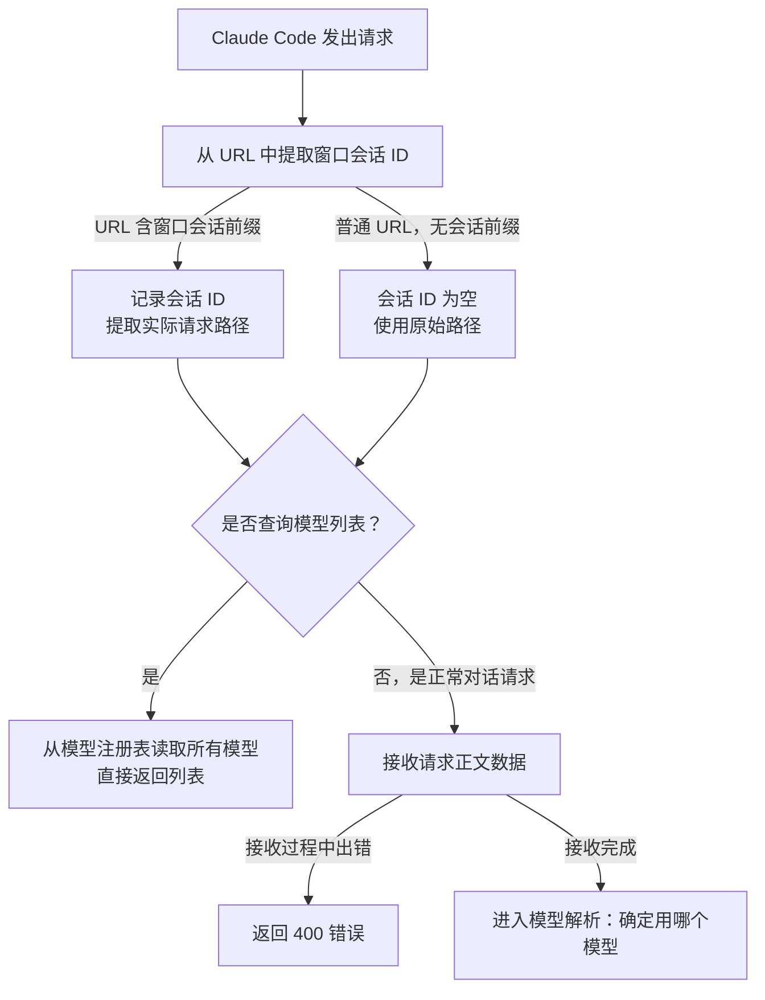
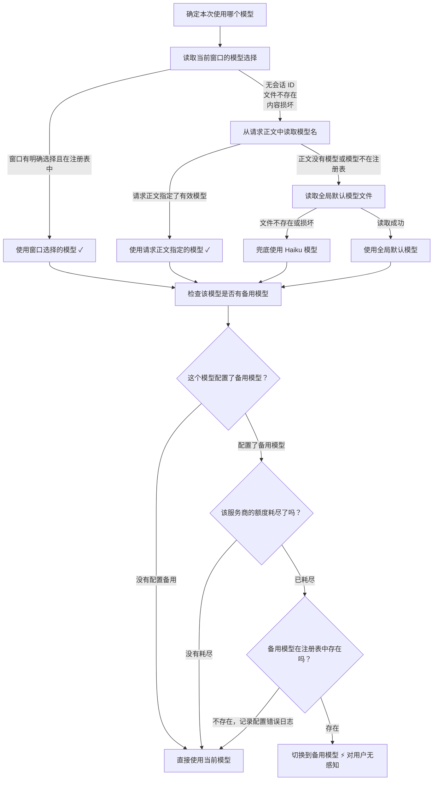
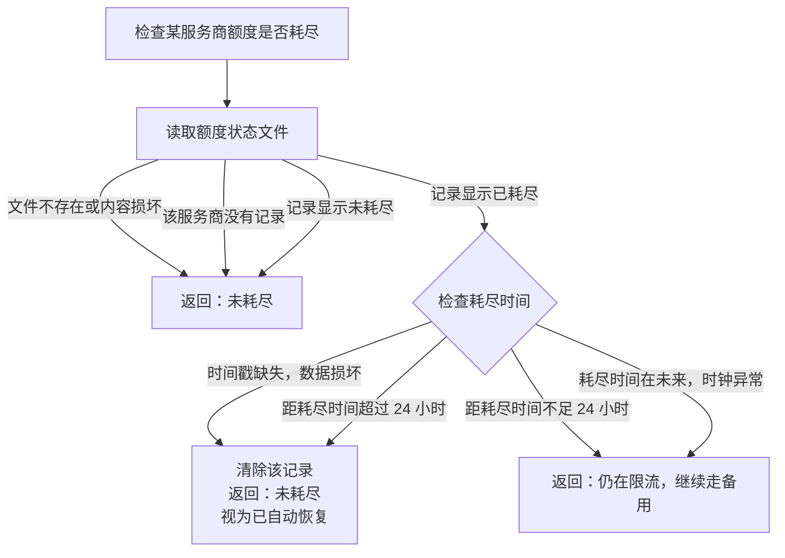
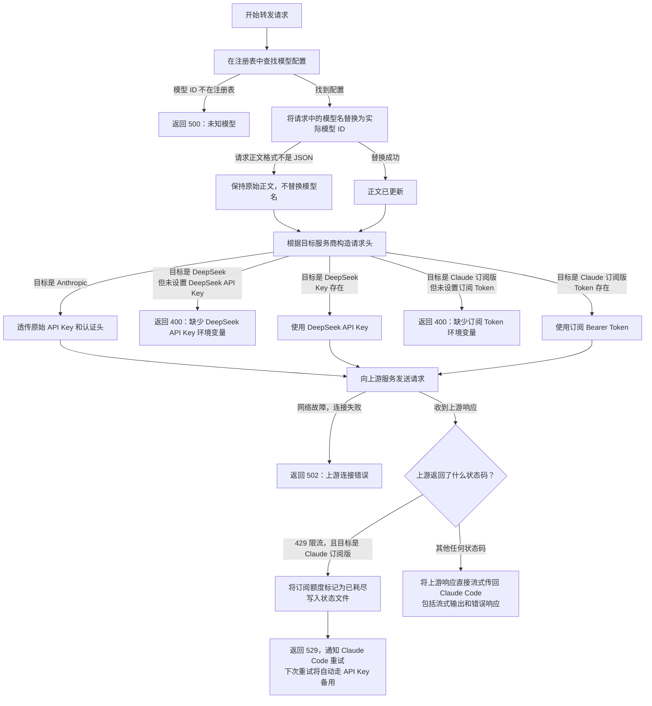
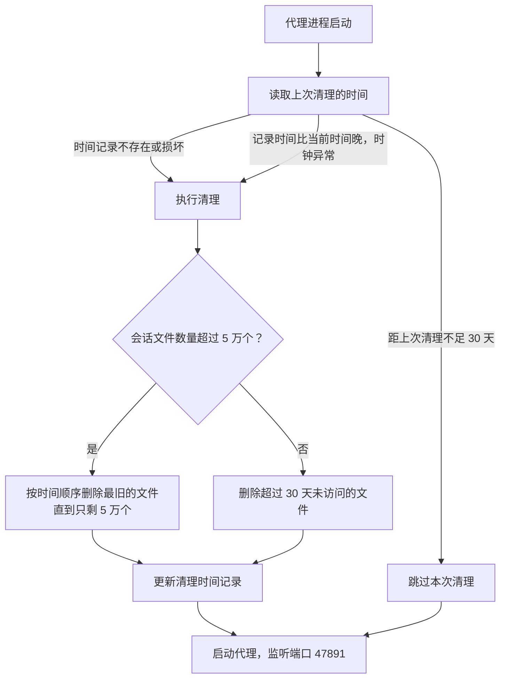

# Claude Code 多模型代理切换方案

## 概述

为 Claude Code 构建一个本地轻量代理服务器，实现在 **不修改 `ANTHROPIC_BASE_URL`、不重启会话** 的前提下，通过 `/models` 交互式命令即时切换底层 LLM 提供商（Anthropic / DeepSeek / Claude 订阅版），并支持订阅额度耗尽后自动 fallback 到 API Key。

## 代码逻辑流程图

### 总览：请求完整生命周期



### 模型选择：三级优先级与额度路由



### 额度状态检查：24 小时重置机制



### 请求转发：构造请求头与处理上游响应



### 启动阶段：过期会话文件清理



## 架构

```
窗口 A                                        窗口 B
┌──────────────┐                              ┌──────────────┐
│  Claude Code │                              │  Claude Code │
│ SESSION=aaa  │                              │ SESSION=bbb  │
└──────┬───────┘                              └──────┬───────┘
       │ ANTHROPIC_BASE_URL=                         │ ANTHROPIC_BASE_URL=
       │ http://127.0.0.1:47891/s/sXXXX              │ http://127.0.0.1:47891/s/sYYYY
       └──────────────────┬───────────────────────────┘
                          ▼
               ┌──────────────────┐
               │  本地代理 :47891  │
               │                  │
               │  解析 /s/{id}    │
               │  读 sessions/    │
               │  {id}.json       │
               └──────┬───────────┘
                       │
               ┌───────┴───────┐
               │  模型路由判断   │
               └───────┬───────┘
          ┌────────────┴────────────┐
          ▼                        ▼
claude-* 模型              deepseek-* 模型
→ api.anthropic.com       → api.deepseek.com
  透传原始 API Key           /anthropic 端点
                             + DEEPSEEK_API_KEY
```

**核心设计要点：**

- 每个 Claude Code 窗口启动时，`session-init.js` 生成唯一 proxy session ID，注入 `ANTHROPIC_BASE_URL=/s/{sessionId}`
- 代理解析 URL 中的 session ID，读取 `sessions/{sessionId}.json` 决定该窗口当前模型
- 两窗口模型完全隔离，互不干扰
- DeepSeek 支持 Anthropic 兼容端点（`/anthropic`），无需格式转换
- 新增模型只需在 `models.json` 中添加一条配置

## 订阅额度 Fallback

选择 `claude-subscription` 模型时，代理优先使用 claude.ai 订阅账号的 session token，额度耗尽（HTTP 429）后自动切换到 API Key，**不丢失数据**。

```
请求进入
  │
  ▼
读取 quota-status.json
  ├── claude-ai 未耗尽 → 用 CLAUDE_SESSION_TOKEN 转发
  │     ├── 成功 → 正常返回
  │     └── 429  → 写 quota-status.json（exhausted=true）
  │               → 返回 529 error（Claude Code 自动重试）
  │               → 下次请求命中 fallback_model（claude-sonnet-4-6）
  └── claude-ai 已耗尽 → 直接用 API Key 转发（无感知）

24 小时后 quota-status.json 自动清除，恢复尝试订阅
```

**所需环境变量：**

```
CLAUDE_SESSION_TOKEN=<claude.ai 的 OAuth Bearer token>
```

从浏览器开发者工具获取：登录 claude.ai → F12 → Application → Cookies → 找 `sessionKey`，或 Network → 任意请求 → `Authorization: Bearer <token>`。

## 文件结构

```
~/.claude/
├── settings.json              # Claude Code 配置（env、hooks、permissions）
├── proxy/
│   ├── server.js              # 代理核心（HTTP → HTTPS 转发 + 模型路由）
│   ├── session-init.js        # SessionStart hook：生成 session ID，写映射文件
│   ├── models.json            # 模型注册表（可扩展）
│   ├── current-model.json     # 全局回退模型（无 session 时使用，运行时生成）
│   ├── sessions/              # per-window 模型选择（运行时生成）
│   │   ├── by-cc-session-{CLAUDE_CODE_SESSION_ID}.txt  # CC会话 → 代理session映射
│   │   └── {proxySessionId}.json                       # 该窗口当前选中模型
│   ├── package.json           # ESM 模块声明
│   ├── start.sh               # 代理启动脚本（跨平台，防重复启动）
│   ├── start-proxy.vbs        # Windows 开机自启脚本（放入启动文件夹）
│   ├── start-claude.ps1       # Windows PowerShell 启动 Claude 的包装脚本
│   ├── claude.cmd             # Windows CMD 启动包装（供 alias 使用）
│   └── proxy.log              # 代理运行日志（运行时生成）
└── skills/
    └── models/
        └── SKILL.md            # /models 技能定义（frontmatter + 指令）
```

## 各文件详解

### 1. settings.json（Claude Code 配置）

```json
{
  "hooks": {
    "SessionStart": [{
      "hooks": [
        {
          "type": "command",
          "command": "bash ~/.claude/proxy/start.sh",
          "async": true,
          "statusMessage": "Starting model proxy..."
        },
        {
          "type": "command",
          "command": "node ~/.claude/proxy/session-init.js $CLAUDE_CODE_SESSION_ID",
          "shell": "bash"
        }
      ]
    }]
  }
}
```

**要点：**

| 配置项 | 作用 |
|--------|------|
| `ANTHROPIC_BASE_URL` | 由 `session-init.js` 动态注入，含 `/s/{sessionId}` 路径 |
| `DEEPSEEK_API_KEY` | 引用系统环境变量，代理通过 `process.env` 读取 |
| 第一个 hook | 异步启动代理进程，不阻塞 |
| 第二个 hook | 同步生成 session ID，注入带 session 路径的 `ANTHROPIC_BASE_URL` |

### 2. models.json（模型注册表）

```json
{
  "models": [
    {
      "id": "claude-opus-4-8",
      "name": "Claude Opus 4.8",
      "provider": "anthropic",
      "description": "最强推理，复杂任务首选"
    },
    {
      "id": "claude-sonnet-4-6",
      "name": "Claude Sonnet 4.6",
      "provider": "anthropic",
      "description": "性能与速度的平衡"
    },
    {
      "id": "claude-haiku-4-5",
      "name": "Claude Haiku 4.5",
      "provider": "anthropic",
      "description": "快速轻量，适合简单任务"
    },
    {
      "id": "deepseek-v4-pro",
      "name": "DeepSeek V4 Pro",
      "provider": "deepseek",
      "description": "高性价比，1M context"
    }
  ]
}
```

**可扩展：** 新增模型只需添加一个对象，包含 `id`、`provider` 字段，并在 `server.js` 的 `PROVIDER_HOSTS` 中注册对应端点。

### 3. session-init.js（session 初始化）

每次 Claude Code 窗口启动时执行：

```js
// 生成唯一 proxy session ID
const sessionId = 's' + randomBytes(4).toString('hex')

// 写映射文件：CLAUDE_CODE_SESSION_ID → proxy session ID
const ccSessionId = process.argv[2]   // 由 hook 传入 $CLAUDE_CODE_SESSION_ID
if (ccSessionId) {
  writeFileSync(`sessions/by-cc-session-${ccSessionId}.txt`, sessionId)
}

// 输出 env 注入，Claude Code 用此 URL 发出所有 API 请求
process.stdout.write(JSON.stringify({
  env: { ANTHROPIC_BASE_URL: `http://127.0.0.1:47891/s/${sessionId}` }
}))
```

`/models` 技能通过 `$CLAUDE_CODE_SESSION_ID` → `by-cc-session-*.txt` → `{sessionId}.json` 的三级查找定位当前窗口的 session。

### 4. current-model.json（全局回退）

```json
{ "model": "claude-haiku-4-5" }
```

仅在无法识别 session（hook 未运行）时使用，所有窗口共享。正常情况下每个窗口使用 `sessions/{id}.json`。

### 5. server.js（代理核心）

核心逻辑：

```
请求到达 :47891/s/{sessionId}/v1/...
    │
    ▼
解析 URL → 提取 sessionId
    │
    ▼
读取 sessions/{sessionId}.json → 获取 modelId（无则读 current-model.json）
    │
    ▼
查找 models.json → 获取 modelConfig（含 provider）
    │
    ▼
覆写请求体中的 model 字段为实际模型 ID
    │
    ├── provider = "anthropic"
    │   → 转发到 api.anthropic.com:443
    │   → 透传原始 Authorization / x-api-key / anthropic-version
    │
    └── provider = "deepseek"
        → 转发到 api.deepseek.com:443/anthropic
        → 替换 x-api-key 为 DEEPSEEK_API_KEY
        → 保留原始 anthropic-version / anthropic-beta
```

**关键实现细节：**

```js
// 1. 请求体覆写：将 Claude Code 发出的 model 字段替换为目标模型
const body = JSON.parse(rawBody.toString())
body.model = modelConfig.id        // 如 "deepseek-v4-pro"
bodyStr = JSON.stringify(body)

// 2. 路由表（通过 pathPrefix 支持不同 API 路径结构）
const PROVIDER_HOSTS = {
  anthropic: { host: 'api.anthropic.com', pathPrefix: '' },
  deepseek:  { host: 'api.deepseek.com',  pathPrefix: '/anthropic' }
}

// 3. Anthropic 透传原始认证，DeepSeek 替换为自有 Key
if (modelConfig.provider === 'anthropic') {
  headers['x-api-key'] = originalHeaders['x-api-key']  // 透传
} else if (modelConfig.provider === 'deepseek') {
  headers['x-api-key'] = process.env.DEEPSEEK_API_KEY  // 替换
}

// 4. EADDRINUSE 静默处理（SessionStart hook 可能重复触发）
server.on('error', (err) => {
  if (err.code === 'EADDRINUSE') {
    process.exit(0)  // 已在运行，静默退出
  }
})
```

### 6. start.sh（启动脚本）

```bash
#!/bin/bash
PROXY_DIR="$HOME/.claude/proxy"
PID_FILE="$PROXY_DIR/.proxy.pid"
LOG_FILE="$PROXY_DIR/proxy.log"

# 检查已运行 → 跳过
if [ -f "$PID_FILE" ]; then
  PID=$(cat "$PID_FILE")
  if kill -0 "$PID" 2>/dev/null; then
    echo "[proxy] Already running (PID: $PID)"
    exit 0
  fi
fi

# 启动并写 PID
cd "$PROXY_DIR"
nohup node server.js > "$LOG_FILE" 2>&1 &
echo $! > "$PID_FILE"
```

防重复启动，通过 PID 文件管理进程生命周期。

### 7. package.json

```json
{
  "name": "claude-proxy",
  "version": "1.0.0",
  "type": "module",
  "description": "Model routing proxy for Claude Code",
  "main": "server.js"
}
```

`"type": "module"` 是必须的 —— server.js 使用 ES Module `import` 语法。

### 8. SKILL.md（/models 技能定义）

```yaml
---
name: models
description: Display and switch between LLM models...
argument-hint: [number|name]
user-invocable: true          # 用户可手动调用
allowed-tools: [Bash, Read, Write]  # 预授权，减少确认弹窗
---
```

**技能文件必须在 `skills/<name>/SKILL.md` 目录结构中**，不能直接放在 `skills/models.md`。这是排查 `/models` 不出现时发现的关键规则。

技能执行流程：
1. 读取 `models.json` 和 `current-model.json`
2. 用 `AskUserQuestion` 弹出交互式选择器
3. 用户选择后写入 `current-model.json`

### 9. models.js（命令行工具，已废弃）

支持两种调用方式：

```bash
node ~/.claude/skills/models/models.js          # 列出所有模型
node ~/.claude/skills/models/models.js 4        # 按编号切换
node ~/.claude/skills/models/models.js deepseek-v4-pro  # 按 ID 切换
```

## 适配过程踩坑记录

### 坑 1：`/models` 技能不出现

**现象：** 文件放在 `~/.claude/skills/models.md`，重启后不显示。

**根因：** Claude Code 要求技能文件在子目录中：`skills/<name>/SKILL.md`，而非 `skills/<name>.md`。

**修复：**
```bash
mkdir -p ~/.claude/skills/models
mv ~/.claude/skills/models.md ~/.claude/skills/models/SKILL.md
```

### 坑 2：缺少 frontmatter 必填字段

**现象：** `SKILL.md` 存在但仍然不出现。

**根因：** 缺少 `user-invocable: true` 和 `allowed-tools`。没有 `user-invocable` 的技能只会被模型自动触发，不会出现在 `/` 命令列表。

**修复：** 添加完整的 YAML frontmatter：
```yaml
---
name: models
description: ...
user-invocable: true
allowed-tools: [Bash, Read, Write]
---
```

### 坑 3：Windows 上 ESM 解析失败

**现象：** 代理启动后无输出。

**根因：** `server.js` 用 `import` 语法但缺少 `package.json` 中的 `"type": "module"`。

**修复：** 创建 `package.json` 声明 ES Module。

### 坑 4：SessionStart hook 重复启动

**现象：** 每次切换模型时代理报端口占用错误。

**根因：** SessionStart hook 可能被多次触发。

**修复：** 在 `server.js` 中捕获 `EADDRINUSE` 错误并静默退出；`start.sh` 通过 PID 文件检查防重复。

### 坑 6：多窗口 /models 互相影响（session 隔离失效）

**现象：** 在窗口 A 切换到 Opus，窗口 B 也跟着变了。

**根因：** `session-init.js` 原本用 `$PPID`（bash 父进程 PID）标识窗口，但在 Claude Code 的 bash 沙箱中，`$PPID` 永远是 `1`，所有窗口共享同一个 `ppid-1.txt`，读到同一个 proxy session ID。`ANTHROPIC_BASE_URL` 在 bash 子进程中也没有携带 `/s/{sessionId}` 路径，两种检测方法全部失效。

**根因分析过程：**
```bash
$ echo $PPID              # → 1（永远，sandbox 限制）
$ echo $ANTHROPIC_BASE_URL # → http://127.0.0.1:47891（无 session 路径）
$ env | grep CLAUDE_CODE_SESSION_ID # → 4a313cb5-...（唯一，每窗口不同！）
```

**修复：** 改用 `CLAUDE_CODE_SESSION_ID` 环境变量（Claude Code 内置，每窗口唯一）：

1. `settings.json` hook 改为传 `$CLAUDE_CODE_SESSION_ID`：
   ```json
   "command": "node ~/.claude/proxy/session-init.js $CLAUDE_CODE_SESSION_ID"
   ```

2. `session-init.js` 写 `by-cc-session-{id}.txt`（而非 `ppid-{pid}.txt`）：
   ```js
   const ccSessionId = process.argv[2]
   writeFileSync(`sessions/by-cc-session-${ccSessionId}.txt`, sessionId)
   ```

3. `/models` skill 检测逻辑改为：
   ```bash
   LOOKUP="$HOME/.claude/proxy/sessions/by-cc-session-${CLAUDE_CODE_SESSION_ID}.txt"
   [ -f "$LOOKUP" ] && SESSION_ID=$(cat "$LOOKUP")
   ```

### 坑 7：订阅 fallback 时数据丢失问题

**现象：** 流式响应进行到一半触发 429，已输出内容截断。

**根因：** 如果代理检测到 429 后立即重试并切换 provider，前半段已推送给 Claude Code，切换后从头生成的内容导致不连贯。

**修复：** 代理不做重试——429 时只写 `quota-status.json` 并向 Claude Code 返回 529 error。Claude Code 自己重试时，代理已读到 `exhausted=true`，直接走 `fallback_model`，全新请求完整响应，零丢失。关键在于 **状态写入发生在响应头阶段（statusCode=429）**，此时流式内容一字未发，拦截完全干净。

### 坑 5：DeepSeek 和 Anthropic Bearer Token 冲突

**现象：** DeepSeek 请求返回 401。

**根因：** Anthropic 的 `authorization: Bearer ...` header 被透传给了 DeepSeek，与 `x-api-key` 冲突。

**修复：** DeepSeek 路径不传递 `authorization` header，仅使用 `x-api-key`。

## 扩展新模型

只需两步：

**步骤 1：** 在 `~/.claude/proxy/models.json` 中添加条目：
```json
{
  "id": "new-model-id",
  "name": "New Model Name",
  "provider": "new-provider",
  "description": "模型描述"
}
```

**步骤 2：** 在 `server.js` 的 `PROVIDER_HOSTS` 和 `buildHeaders` 中添加路由：
```js
const PROVIDER_HOSTS = {
  // ...
  'new-provider': { host: 'api.new-provider.com', pathPrefix: '/v1' }
}

// buildHeaders 中添加对应的认证逻辑
else if (modelConfig.provider === 'new-provider') {
  headers['authorization'] = `Bearer ${process.env.NEW_PROVIDER_API_KEY}`
}
```

## 安装与配置

### 前置条件

- Node.js 18+
- Claude Code CLI（`npm install -g @anthropic-ai/claude-code`）
- Anthropic API Key（必须）；DeepSeek API Key（可选）

### 步骤

**1. 克隆到 proxy 目录**
```bash
git clone https://github.com/OscarYi9527/skill-models ~/.claude/proxy
```

**2. 设置环境变量**

在系统环境变量中添加（不要写进代码）：
```
ANTHROPIC_API_KEY=sk-ant-...
DEEPSEEK_API_KEY=sk-...       # 使用 DeepSeek 时必须
ANTHROPIC_BASE_URL=http://127.0.0.1:47891
```

**3. 更新 ~/.claude/settings.json**

添加 SessionStart hooks（参见第 1 节配置示例）。

**4. 安装 /models 技能**

将本仓库的 `skills/models/SKILL.md` 复制到：
```bash
cp skills/models/SKILL.md ~/.claude/skills/models/SKILL.md
```

**5. Windows：设置代理开机自启**

将 `start-proxy.vbs` 的快捷方式放入 Windows 启动文件夹：
```
Win+R → shell:startup → 粘贴 start-proxy.vbs 的快捷方式
```

**6. 验证**
```bash
# 启动代理
bash ~/.claude/proxy/start.sh

# 检查代理是否运行
netstat -an | grep 47891 | grep LISTENING

# 启动 Claude Code
claude
# 然后在会话内输入 /models
```

## 运行时状态验证

```bash
# 检查代理是否运行
netstat -an | grep 47891 | grep LISTENING

# 查看当前模型
cat ~/.claude/proxy/current-model.json

# 手动切换模型
node ~/.claude/skills/models/models.js 1

# 查看代理日志
cat ~/.claude/proxy/proxy.log
```
